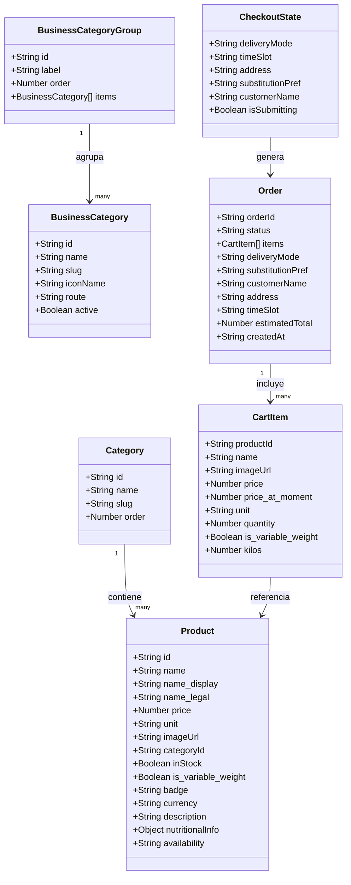
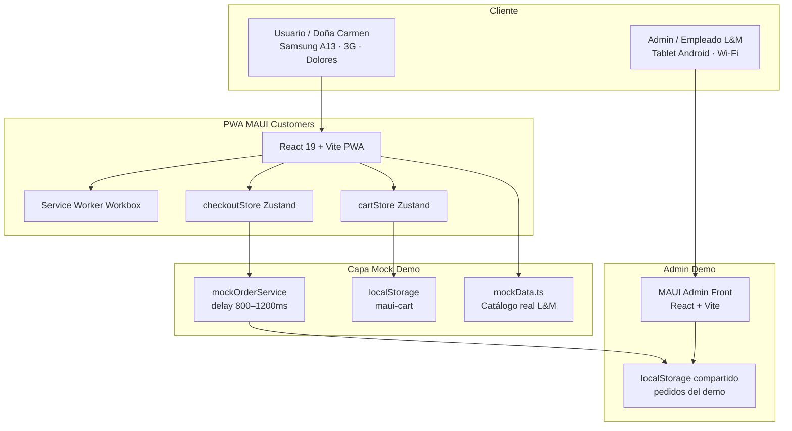
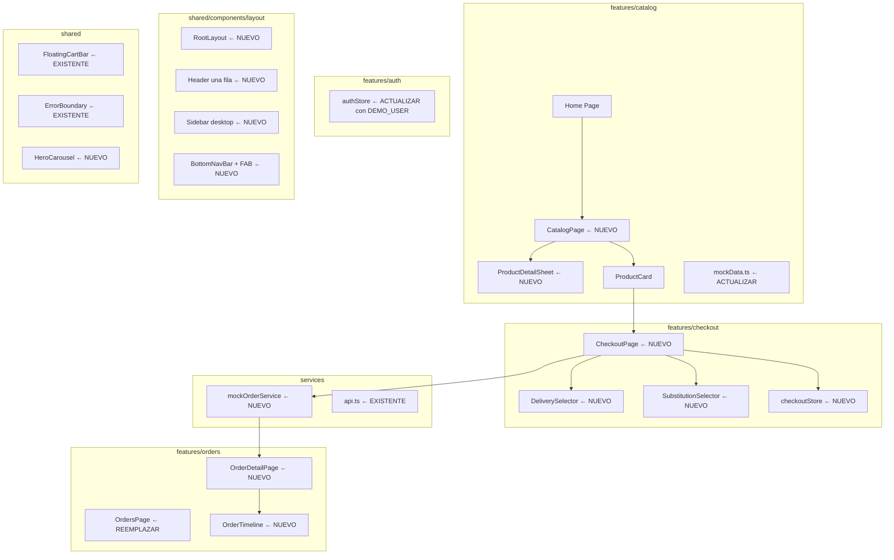
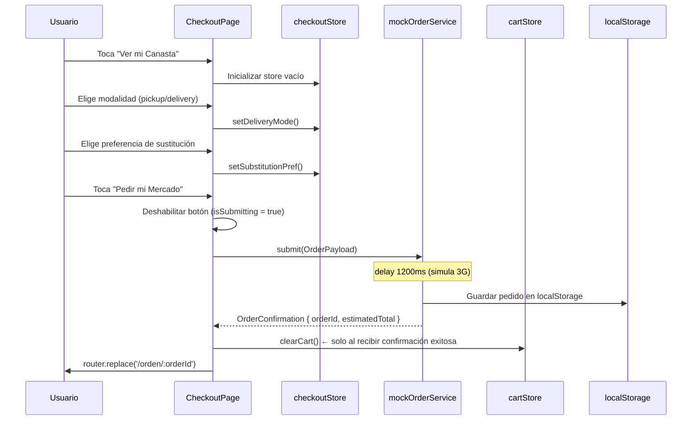
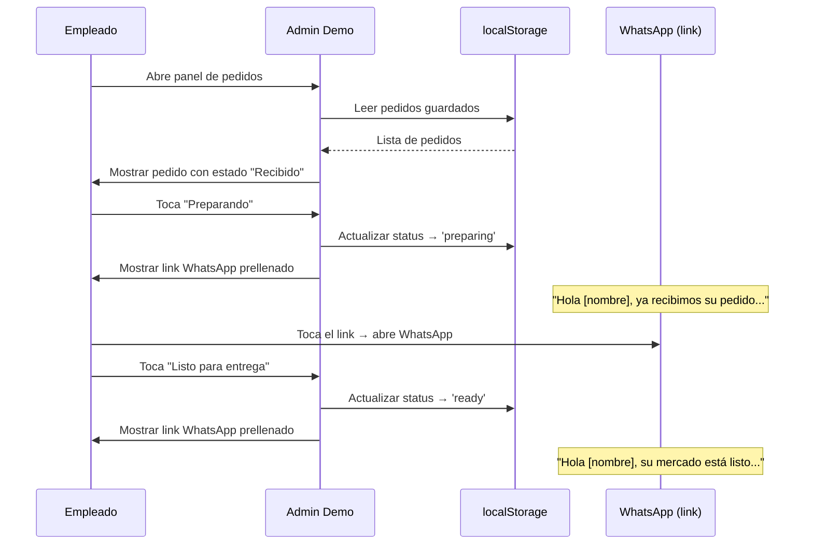

# RFC - Demo MAUI PWA Customers — Validación con Usuarios Reales antes de la Implementación Real

> **Estado:** `Approved`
> **Autor(es):** [Nixon Gamboa](mailto:nixon.gamboag@gmail.com)
> **Fecha:** 12 May 2026
> **Aprobado:** 02 Jun 2026
> **Aprobadores:** Nixon Gamboa

---

# Resumen

Se propone construir una demo funcional de la PWA MAUI Customers completa — con datos reales de Leche y Miel y flujos de punta a punta simulados mediante mocks — antes de invertir en infraestructura backend real. El objetivo es validar con usuarios reales de Dolores, Tolima, que el producto es comprensible, confiable y usable en condiciones reales (3G, Android gama media, bajo sol), y obtener un Go/No-Go explícito antes de iniciar el Sprint 1 de backend. Owner: Nixon Gamboa.

---

# 1. Objetivo y Motivación

## 1.1. Problema actual

La PWA MAUI Customers tiene aproximadamente el 55% del frontend construido, pero el flujo de valor completo no funciona de punta a punta. No existe backend, no existe panel admin, y el catálogo usa datos placeholder que no corresponden a productos reales de Leche y Miel. En este estado es imposible validar si el producto resuelve el problema real de los usuarios de Dolores.

El riesgo concreto: construir el backend (AWS SAM + Lambda + DynamoDB + WhatsApp Gateway) implica 4–6 semanas de inversión. Si al finalizar esa inversión se descubre que el flujo de checkout genera confusión, que el copy no es claro para usuarios no digitalizados, o que el empleado de la tienda no puede operar el panel admin durante su hora más ocupada, el costo de corrección es alto. Las fricciones de UX son 10x más baratas de corregir antes del backend que después.

Adicionalmente, hay gaps técnicos concretos que bloquean la demo:
- `/catalog/:categoryId` no existe como componente de página
- `/checkout` no está implementado
- `/orden/:orderId` no existe
- `OrdersPage` es un placeholder vacío
- El catálogo usa productos ficticios (queso campesino, carne molida) que no son parte del inventario de Leche y Miel

## 1.2. Propósito

Construir y desplegar una versión demo de la PWA MAUI Customers que:

1. Complete todos los flujos del usuario de punta a punta usando servicios mock que respetan el contrato de la API real
2. Use datos reales del catálogo de Leche y Miel (fotos, precios y nombres verificados con el aliado)
3. Se despliegue en una URL pública instalable como PWA
4. Permita ejecutar una sesión de validación estructurada con 5 usuarios reales de Dolores y con el empleado de la tienda
5. Genere un Go/No-Go explícito basado en intención de comportamiento real, no en opiniones

La demo no es un prototipo de Figma ni una presentación — es una PWA real funcionando, diferenciada de producción únicamente en que la capa de datos usa mocks en lugar de llamadas al backend.

> **Alcance de esta Feature (Fase 1 — implementación):** Todo lo relacionado con la construcción del código: componentes, servicios mock, datos reales del catálogo de Leche y Miel, y despliegue en URL pública instalable como PWA. Los objetivos 4 y 5 listados arriba (ejecución de sesiones con usuarios, Go/No-Go) son **Fase 2** y se ejecutan una vez entregada la Fase 1. Ver §9.

## 1.3. Objetivos

* Validar que el flujo de navegación (Home → Pasillo → Producto → Carrito → Checkout → Confirmación) es comprensible sin instrucciones para usuarios no digitalizados de Dolores
* Validar que el copy, los textos y las acciones generan confianza en el contexto cultural específico (pago contra entrega en efectivo, productos locales conocidos)
* Validar que el empleado de Leche y Miel puede procesar pedidos en el panel admin sin entrenamiento extenso
* Garantizar que los contratos de datos de los mocks son idénticos a los que usará el backend real, para que el swapeo sea quirúrgico cuando llegue el Sprint 1
* Documentar aprendizajes y fricciones en `tareas/demo-feedback.md` para informar el diseño del backend

---

# 2. Drivers de Arquitectura

## 2.1. Funcionalidades del Sistema

| # | Funcionalidad |
| :---- | :---- |
| **FU-1** | Catálogo navegable por pasillos con datos reales de Leche y Miel (~15 productos, fotos WebP <30KB) |
| **FU-2** | Gestión de carrito persistente en localStorage con cálculo de totales en tiempo real |
| **FU-3** | Checkout completo en 4 steps: resumen → modalidad (pickup/domicilio) → sustitución → confirmación |
| **FU-4** | Pantalla de confirmación con número de orden, instrucción de pago en efectivo y aviso Ley 1581 |
| **FU-5** | Timeline de estado del pedido con 5 estados animados y botón de WhatsApp prellenado |
| **FU-6** | Panel admin demo: lista de pedidos, detalle, botones de transición de estado, link WhatsApp por estado |
| **FU-7** | Simulador de progreso de estado (para demos en vivo): avanza el estado automáticamente cada 20s |
| **FU-8** | Auth mock: usuario pre-autenticado sin Magic Link real para desbloquear el flujo de checkout |

## 2.2. Casos de Uso

| # | Caso de Uso | Descripción |
| :---- | :---- | :---- |
| **CU-1** | Navegar catálogo | El usuario abre la app, selecciona un pasillo, ve los productos disponibles y accede al detalle de uno |
| **CU-2** | Agregar al carrito | El usuario toca `+` en un producto, el carrito flotante aparece con el total actualizado |
| **CU-3** | Completar checkout | El usuario revisa el carrito, elige modalidad (pickup o domicilio), elige preferencia de sustitución y confirma el pedido |
| **CU-4** | Ver confirmación | El usuario ve la pantalla de éxito con el número de orden y la instrucción "Pagas en efectivo cuando llegue tu pedido" |
| **CU-5** | Monitorear pedido | El usuario accede a `/orden/:id`, ve el estado actual en la timeline y puede contactar a la tienda por WhatsApp |
| **CU-6** | Empleado procesa pedido | El empleado abre el admin demo, ve el pedido entrante, avanza el estado y envía el WhatsApp correspondiente al cliente |
| **CU-7** | Producto agotado | El usuario ve un producto con badge "Agotado" y el botón `+` deshabilitado; la UI no permite agregarlo |

## 2.3. Modelo de Dominio

### 2.3.1. Representación



### 2.3.2. Catálogo de Elementos

| Elemento | Descripción |
| :---- | :---- |
| `Product` | Producto del catálogo de Leche y Miel. `is_variable_weight: true` para productos vendidos por peso (ej. queso campesino). Campos opcionales: `description`, `nutritionalInfo`, `availability` |
| `Category` | Pasillo de la tienda (agrupación de producto dentro del aliado L&M) |
| `BusinessCategory` | Vertical de la plataforma MAUI (groceries, farmacia, mascotas, …). Aparece en sidebar/menú y enruta a un sub-marketplace. Independiente de los pasillos de un aliado |
| `BusinessCategoryGroup` | Agrupación lógica de `BusinessCategory` (p. ej. "Compras", "Servicios"). Se usa para renderizar secciones colapsables en el sidebar |
| `CartItem` | Ítem en el carrito. `price_at_moment` es snapshot de precio al agregar. `kilos` solo para `is_variable_weight === true`; el total calcula `kilos × precio` en ese caso |
| `Order` | Pedido generado localmente por el mock. En producción vendrá del backend |
| `CheckoutState` | Store efímero de Zustand que vive solo durante el flujo de checkout |

## 2.4. Restricciones de Diseño

| Descripción | Tipo |
| :---- | :---- |
| Productos `is_variable_weight: true` usan `VariableWeightSheet` (0.25–5 kg, paso 0.25). `CartItem.kilos` persiste la selección. El total usa `kilos × precio` | Negocio |
| No se implementa SearchPage — los pasillos son suficientes para ~15 productos | Negocio |
| No hay backend real — toda comunicación pasa por `mockOrderService` con delay 800–1200ms | Técnica |
| No hay WhatsApp Magic Link real — el demo usa un usuario pre-autenticado (`DEMO_USER`) | Técnica |
| Las imágenes del catálogo deben ser WebP, 400×400px, <30KB | Técnica |
| El aviso de Ley 1581 debe aparecer visible en el checkout antes del CTA | Negocio / Legal |
| El CTA del checkout es siempre "Pedir mi Mercado" — prohibida la palabra "Pagar" | Negocio |
| `router.replace()` en la pantalla de confirmación — nunca `router.push()` | Técnica |
| El carrito se destruye solo al recibir respuesta exitosa del mock (simulando el 201) | Técnica |
| Las categorías del catálogo deben ser los pasillos reales de Leche y Miel, confirmados con el aliado | Negocio |
| Dark mode disponible vía `ThemeToggle` en el Header. Preferencia persistida en `localStorage` key `maui-theme`. Clase `.dark` sincronizada en `document.documentElement` vía `useThemeSync` | UX |
| Envío gratis cuando el subtotal >= $30.000 COP; costo estándar $3.000. Calculado por `calculateShipping()` en `features/checkout/shipping.ts`. Configurable vía `FREE_SHIPPING_THRESHOLD` y `STANDARD_SHIPPING_COST` en `config/app.ts` | Negocio |
| Nunca mezclar `BusinessCategory` (vertical de plataforma) con `Category` (pasillo de producto del aliado). El sidebar/menú principal renderiza `BusinessCategory`; las tarjetas de catálogo de un aliado renderizan `Category` | Negocio / Técnica |
| Layout PWA-nativo: `Header` de una sola fila + `BottomNavBar` con FAB en móvil + `Sidebar` colapsable en desktop. Respetar `env(safe-area-inset-bottom)` al renderizar el bottom nav cuando la PWA está instalada | Técnica |
| Las imágenes circulares de categorías principales (Home) son PNG 96×96 con fondo transparente. Se cargan desde `assets/` como módulo importado para que Vite las versione | Técnica |

## 2.5. Atributos de Calidad

| # | Categoría | Atributo | Escenario | Caso de Uso Relacionado |
| :---- | :---- | :---- | :---- | :---- |
| **QA-1** | Rendimiento | Carga inicial <4s en 3G | La PWA carga en un Samsung A13 con señal 3G en Dolores | CU-1 |
| **QA-2** | Accesibilidad | Contraste mínimo 7:1 | El usuario usa la app bajo sol directo en exterior | Todos |
| **QA-3** | Usabilidad | Zona del pulgar | Todos los CTAs primarios están en la mitad inferior de la pantalla | CU-2, CU-3 |
| **QA-4** | Resiliencia | Carrito persistente | El usuario cierra la app accidentalmente y el carrito se recupera al volver | CU-2 |
| **QA-5** | Resiliencia | No doble submit | El botón "Pedir mi Mercado" se deshabilita mientras `isSubmitting === true` | CU-3 |
| **QA-6** | Offline | Carga desde caché | El home y el catálogo son visibles sin conexión desde el Service Worker | CU-1 |
| **QA-7** | Confianza | Pago explícito | El usuario ve "Pagas en efectivo cuando llegue tu pedido" antes de confirmar | CU-4 |
| **QA-8** | Legal | Consentimiento datos | El aviso de Ley 1581 es visible antes del CTA en el checkout | CU-3 |
| **QA-9** | PWA-nativa | BottomNav accesible | `BottomNavBar` respeta `env(safe-area-inset-bottom)`; sin scroll horizontal en móvil; FAB carrito en zona del pulgar | CU-1, CU-2 |

---

# 3. Diseño Detallado

## 3.1. Contexto de la Solución

### 3.1.1. Representación



### 3.1.2. Catálogo de Elementos

| Nombre | Descripción |
| :---- | :---- |
| PWA MAUI Customers | App React 19 instalable como PWA. Contiene todos los flujos del cliente |
| Service Worker (Workbox) | CacheFirst para imágenes, StaleWhileRevalidate para API. Habilita offline y carga rápida |
| cartStore | Store Zustand persistido en localStorage. Sobrevive cierres de app |
| checkoutStore | Store Zustand efímero. Solo existe durante el flujo de checkout |
| mockOrderService | Servicio que simula POST /orders y GET /orders/:id con el mismo contrato que el backend real |
| mockData.ts | Catálogo con ~15 productos reales de Leche y Miel. Reemplazable por queryFn real sin tocar componentes |
| localStorage (pedidos) | Mecanismo de comunicación entre la PWA cliente y el admin demo en el Sprint DEMO |
| MAUI Admin Front | Panel para el empleado de la tienda. Demo basado en localStorage, sin backend real |

## 3.2. Descomposición de la Solución

### 3.2.1. Representación



### 3.2.2. Catálogo de Elementos

| Nombre | Descripción |
| :---- | :---- |
| `CatalogPage` | Grid de productos por pasillo. Recibe `categoryId` desde la ruta. Skeleton loaders obligatorios |
| `ProductDetailSheet` | Bottom sheet (`createPortal`, 90dvh) con imagen 4:3, descripción, info nutricional, chip de disponibilidad y selector de cantidad. Precio total dinámico en CTA. Reemplaza `ProductDetailModal` |
| `CheckoutPage` | Flujo de 4 steps en una sola página. Orquesta `DeliverySelector`, `SubstitutionSelector` y el submit |
| `DeliverySelector` | Selector de modalidad: pickup (3 bandas de hora) vs domicilio (dirección + geolocalización) |
| `SubstitutionSelector` | Radio buttons con las 3 opciones de sustitución. Bloquea el CTA hasta que se elija una |
| `checkoutStore` | Store Zustand sin persistencia. Se destruye al confirmar o al salir del flujo |
| `OrderDetailPage` | Timeline del pedido con 5 estados. Polling simulado. Botón WhatsApp prellenado |
| `OrderTimeline` | Componente visual del stepper de estados con animación en la transición |
| `mockOrderService` | Implementa la interfaz `OrderService` con delays que simulan latencia 3G |
| `authStore` (actualizado) | Expone `DEMO_USER` pre-autenticado. Sin Magic Link real en la demo |
| `ProductCard` (refactored) | FAB `+` circular cuando `quantity === 0`; se reemplaza por `QuantityStepper` cuando `quantity > 0`. Badge "Local" en verde. Precio y CTA en la misma fila |
| `QuantityStepper` | Pill `bg-brand-primary` con botones −/+. Soporta long-press (1 s delay, repite 300 ms) |
| `VariableWeightSheet` | Bottom sheet para selección de kilogramos (0.25–5 kg, paso 0.25). Precio estimado en COP en tiempo real. `initialKilos` precarga al editar. `createPortal` al body. `safe-area-inset-bottom` respetado |
| `useProductQuantity` | Hook que expone `quantity`, `kilos`, `increment` y `decrement` desde `cartStore` |
| `RootLayout` | Layout raíz de la app. Renderiza `Header`, `Sidebar` (desktop), `BottomNavBar` (móvil) y el `<Outlet/>` de React Router |
| `Header` (una fila) | Barra superior compacta con logo, buscador y CTAs. Versión móvil colapsa acciones secundarias dentro del menú |
| `Sidebar` (desktop) | Panel lateral colapsable con `BusinessCategoryGroup`/`BusinessCategory`. Renderiza chevrons y animación de despliegue |
| `BottomNavBar` (móvil) | Navegación inferior estilo PWA-nativa con FAB central. Respeta `env(safe-area-inset-bottom)`. Oculta en rutas modales (`/checkout`, `/orden/:id`) si aplica |
| `HeroCarousel` | Carrusel del Home con banners horizontales. Gradiente compacto en móvil tras iteración 2026-06-08 |
| `Home` (rediseñada) | Estructura vertical en 5 secciones: hero, categorías principales (PNG circulares 96×96), MAUI+, sidebar inline para móvil y productos destacados |

## 3.3. Schema / Contrato de Datos

El contrato de `mockOrderService` es idéntico al que usará el backend real. El swapeo es un cambio de import.

```typescript
// Contrato compartido entre mock y servicio real
interface OrderService {
  submit(payload: OrderPayload): Promise<OrderConfirmation>
  getById(orderId: string): Promise<Order>
  list(): Promise<Order[]>
}

// Payload que el frontend envía al crear un pedido
interface OrderPayload {
  items: Array<{
    id: string
    qty: number
    priceAtMoment: number
  }>
  substitutionPreference: 'call_me' | 'similar' | 'remove'
  deliveryType: 'pickup' | 'delivery'
  deliveryData: {
    address?: string
    lat?: number
    lng?: number
    timeSlot?: 'morning' | 'afternoon' | 'asap'
  }
  customerName: string
}

// Respuesta del servidor al crear el pedido
interface OrderConfirmation {
  orderId: string           // Formato demo: `MAUI-${Date.now()}`
  status: 'received'
  estimatedTotal: number
}
```

| Campo | Tipo | Descripción | Aplicación que lo usa |
| :---- | :---- | :---- | :---- |
| `orderId` | String | Identificador único del pedido. Demo: `MAUI-{timestamp}`. Producción: NanoID | Cliente, Admin |
| `priceAtMoment` | Number | Snapshot del precio al agregar al carrito. Evita disputas si el precio cambia | Cliente |
| `substitutionPreference` | Enum | Decisión del cliente si un producto no está. Mandatorio antes del submit | Cliente, Admin |
| `deliveryType` | Enum | `pickup` o `delivery`. Determina qué campos de `deliveryData` son requeridos | Cliente, Admin |
| `timeSlot` | Enum | 3 bandas: `morning`, `afternoon`, `asap`. No horas exactas | Cliente, Admin |
| `customerName` | String | Captura silenciosa en el primer pedido. Pre-llenado en los siguientes | Cliente |

## 3.4. Patrones de Acceso

| Operación | Dominio | Tipo | Parámetros | Notas |
| :---- | :---- | :---- | :---- | :---- |
| Crear pedido | Orders | Mock → localStorage | `OrderPayload` | Delay 1200ms. En producción: POST /orders |
| Obtener pedido | Orders | Mock → localStorage | `orderId: string` | Delay 800ms. En producción: GET /orders/:id |
| Listar pedidos | Orders | Mock → localStorage | — | Delay 600ms. En producción: GET /orders |
| Listar productos | Catalog | React Query → mockData | `categoryId?: string` | staleTime 5min. En producción: GET /catalog/products |
| Listar categorías | Catalog | React Query → mockData | — | staleTime 10min. En producción: GET /catalog/categories |
| Persistir carrito | Cart | Zustand persist → localStorage | — | Key: `maui-cart`. Staleness: 30 días |

## 3.5. Diagramas de Secuencia

### 3.5.1. CU-3: Checkout completo (mock)



### 3.5.2. CU-6: Empleado procesa pedido en admin demo



## 3.6. Estructura de la Aplicación

### 3.6.1. Representación

```
MAUI-PWA-customers/src/                  ← path flattened (antes client/src/)
├── features/
│   ├── catalog/
│   │   ├── pages/
│   │   │   └── CatalogPage.tsx          ← NUEVO
│   │   ├── components/
│   │   │   ├── ProductDetailSheet.tsx   ← NUEVO (reemplaza ProductDetailModal.tsx)
│   │   │   ├── HeroCarousel.tsx         ← NUEVO
│   │   │   ├── ProductCard.tsx          ← REFACTORED (FAB/Stepper/kg-pill)
│   │   │   ├── QuantityStepper.tsx      ← NUEVO
│   │   │   └── VariableWeightSheet.tsx  ← ACTUALIZADO (kg, createPortal)
│   │   ├── mockData.ts                  ← ACTUALIZAR con datos reales L&M
│   │   └── README.md
│   ├── checkout/
│   │   ├── CheckoutPage.tsx
│   │   ├── DeliverySelector.tsx
│   │   ├── SubstitutionSelector.tsx
│   │   ├── checkoutStore.ts
│   │   └── shipping.ts                  ← NUEVO (calculateShipping)
│   ├── orders/
│   │   ├── OrdersPage.tsx               ← REEMPLAZAR placeholder
│   │   ├── OrderDetailPage.tsx          ← NUEVO
│   │   └── OrderTimeline.tsx            ← NUEVO
│   └── auth/
│       └── pages/AuthPage.tsx
│
├── shared/
│   ├── components/
│   │   ├── layout/
│   │   │   ├── RootLayout.tsx
│   │   │   ├── Header.tsx               ← ACTUALIZADO (md:sticky)
│   │   │   ├── Sidebar.tsx
│   │   │   ├── SidebarSection.tsx
│   │   │   ├── BottomNavBar.tsx         ← ACTUALIZADO (slide-out)
│   │   │   └── FloatingCartBar.tsx
│   │   └── ui/
│   │       └── ThemeToggle.tsx          ← NUEVO
│   ├── hooks/
│   │   ├── useProductQuantity.ts        ← ACTUALIZADO (expone kilos)
│   │   └── useThemeSync.ts             ← NUEVO
│   └── utils/
│       └── formatPrice.ts              ← NUEVO
│
├── hooks/                               ← NUEVO directorio
│   ├── useCatalog.ts
│   ├── useFeaturedProducts.ts
│   └── useBusinessCategoryGroups.ts
│
├── types/                               ← NUEVO directorio
│   ├── catalog.ts                       ← Product, Category, BusinessCategory…
│   └── order.ts
│
├── stores/
│   ├── cartStore.ts                     ← ACTUALIZADO (updateKilos, calcTotals kg)
│   ├── authStore.ts                     ← DEMO_USER cuando VITE_DEMO_MODE=true
│   ├── themeStore.ts                    ← NUEVO (Zustand persist, light|dark)
│   └── uiStore.ts                       ← ACTUALIZADO (bottomSheetOpen)
│
├── assets/                              ← NUEVO: PNG circulares categorías
│   └── categories/*.png
│
├── services/
│   ├── mockOrderService.ts              ← NUEVO
│   └── api.ts                           ← EXISTENTE (sin cambios)
│
└── config/
    └── app.ts                           ← FIX: número real de L&M
```

### 3.6.2. Catálogo de Elementos

| Nombre | Descripción |
| :---- | :---- |
| `features/catalog/components/QuantityStepper.tsx` | Counter pill inline. Reemplaza el FAB cuando `quantity > 0` |
| `features/catalog/components/VariableWeightSheet.tsx` | Bottom sheet para productos de peso variable (0.25–5 kg, paso 0.25). `onConfirm(kilos)` persiste en `CartItem.kilos`; `cartStore.updateKilos()` permite editar desde `CartItemRow`. Precio estimado en COP en tiempo real. Implementado. |
| `shared/hooks/useProductQuantity.ts` | Expone `quantity`, `kilos`, `increment` y `decrement` por `productId` desde `cartStore` |
| `features/checkout/` | Nuevo directorio. Contiene toda la lógica y UI del flujo de pedido |
| `services/mockOrderService.ts` | Implementa `OrderService`. Único archivo a reemplazar cuando llegue el backend real |
| `CartPage.tsx` | Fix: CTA actual dice "Confirmar pedido" → debe decir "Pedir mi Mercado" |
| `config/app.ts` | Fix: número de WhatsApp y teléfono deben ser los reales de Leche y Miel |
| `shared/components/layout/` | Layout PWA-nativo: `RootLayout`, `Header` (una fila), `Sidebar` colapsable desktop, `BottomNavBar` con FAB en móvil |
| `hooks/` | Hooks de datos sobre React Query: `useCatalog`, `useFeaturedProducts`, `useBusinessCategoryGroups` |
| `types/` | Tipos compartidos del dominio frontend: `Product`, `Category`, `BusinessCategory`, `BusinessCategoryGroup`, `Order` |
| `stores/` | Stores Zustand centralizados (`cartStore`, `authStore`). Migrados desde `features/*/store.ts` |
| `assets/categories/` | PNG circulares 96×96 con fondo transparente para las categorías principales del Home |

## 3.7. Estrategia Multi-entorno

La demo se despliega en un entorno estático único (`demo`). La variable de entorno `VITE_DEMO_MODE=true` activa `mockOrderService` en lugar de `realOrderService`. En el entorno de producción (`VITE_DEMO_MODE=false`), `api.ts` toma el control sin ningún cambio en los componentes.

```typescript
// services/index.ts
export const orderService: OrderService =
  import.meta.env.VITE_DEMO_MODE === 'true'
    ? mockOrderService
    : realOrderService
```

---

# 4. Stack Tecnológico

## 4.1. Lenguaje, Frameworks y Librerías

| Nombre | Versión | Descripción |
| :---- | :---- | :---- |
| React | 19.1.0 | UI framework. Automatic batching, Suspense para lazy loading de rutas |
| TypeScript | 5.8.3 | Strict mode. Protege el contrato de datos entre mock y servicio real |
| Vite | 7.1.7 | Build tool. Alias `@` → `src/`, code splitting por ruta |
| Zustand | 5.0.8 | Estado global. `persist` para carrito, efímero para checkout |
| TanStack React Query | 5.90.2 | Data fetching con cache. `staleTime` configurado por tipo de dato |
| TailwindCSS | 3.4.15 | Design tokens MAUI. Contraste WCAG 2.1 AA garantizado en configuración |
| vite-plugin-pwa | 1.0.3 | Service Worker con Workbox. CacheFirst imágenes, StaleWhileRevalidate API |
| Lucide React | 0.575.0 | Iconografía |
| React Router DOM | 7.9.3 | Routing con lazy loading. `router.replace()` en confirmación |

## 4.2. Puntos de Integración

| Sistema | Dirección | Tecnología | Descripción |
| :---- | :---- | :---- | :---- |
| localStorage | Bidireccional | Web Storage API | Persistencia del carrito (`maui-cart`) y comunicación entre PWA y admin demo (pedidos) |
| WhatsApp | Salida | Deep link `wa.me` | Links prellenados para soporte y notificaciones del empleado. Sin API — el usuario toca el link |
| Geolocation API | Entrada | Browser API | Botón "Usar mi ubicación" en el selector de domicilio |
| Service Worker | Bidireccional | Workbox 7 | Cache de assets e interceptación de requests de la API para StaleWhileRevalidate |
| Vercel / Netlify / S3 | Salida | Static hosting | Deploy del build de Vite. Sin servidor — solo archivos estáticos |

---

# 5. Calidad

## 5.1. Retrocompatibilidad

El `mockOrderService` implementa la misma interfaz TypeScript que el servicio real futuro. Al agregar el backend, se agrega `realOrderService.ts` con la misma firma y se cambia el export en `services/index.ts`. Ningún componente requiere modificación.

El campo `is_variable_weight` está activo en el demo para productos como queso campesino. `CartItem.kilos` persiste la selección; `cartStore.updateKilos()` permite editarla desde `CartItemRow`. Cuando un aliado futuro requiera más productos por peso, solo se actualiza `mockData.ts` — sin cambios en el modelo de datos.

## 5.2. Escenarios de Calidad / Testing

| # | Escenario | Caso de Uso Asociado |
| :---- | :---- | :---- |
| **SC-1** | Usuario toca "Pedir mi Mercado" dos veces rápidamente → solo se crea un pedido | CU-3 |
| **SC-2** | Usuario cierra la app en medio del checkout → al volver, el carrito está intacto | CU-2 |
| **SC-3** | Usuario completa el checkout → el carrito queda vacío solo después de la confirmación exitosa | CU-3 |
| **SC-4** | Usuario presiona Atrás desde la confirmación → cae en Home, no en el checkout ya enviado | CU-4 |
| **SC-5** | Usuario recarga la pantalla de confirmación → el número de orden sigue visible | CU-4 |
| **SC-6** | Producto con `inStock: false` → botón `+` oculto, badge "Agotado" visible | CU-7 |
| **SC-7** | Usuario selecciona 0.75 kg de queso campesino → carrito muestra subtotal correcto (`kilos × precio`) | CU-2 |
| **SC-8b** | Usuario edita el peso desde `CartItemRow` → `VariableWeightSheet` reabre con `initialKilos` precargado | CU-2 |
| **SC-8** | Catálogo cargado desde caché sin conexión → el usuario ve los productos disponibles | CU-1 |

## 5.3. Estrategia de Validación

> **Fase 2 — Fuera del scope de construcción de código.** Esta sección describe el protocolo a ejecutar una vez que la demo esté construida y desplegada (ver §9). No genera tareas de implementación.

La calidad del demo no se mide con tests automatizados sino con validación de comportamiento real:

**Sesión con clientes (5 usuarios de Dolores):**
- Instrucción única: "Imagina que vas a hacer el mercado de la semana. Usa la app como quieras."
- El facilitador no indica pasos. Anota cada punto de detención.
- Al finalizar: "¿Lo usarías?", "¿Se lo recomendarías?", "¿Qué cambiarías?"

**Sesión con el aliado (empleado de Leche y Miel):**
- Walkthrough previo del admin antes de la sesión con clientes
- El empleado procesa 3 pedidos de prueba sin instrucciones del facilitador

**Antes de la sesión — simulación de red degradada:**
Para validar la experiencia en condiciones reales de Dolores, ejecutar al menos un flujo completo (Home → Checkout → Confirmación) con latencia de red alta. Opciones:
- Chrome DevTools → Network → "Slow 3G" (75 Kbps download)
- Desactivar WiFi y usar datos móviles 3G en el dispositivo Android de prueba
- El mock tiene delay 800–1200ms; en 3G real pueden darse picos de 3–5s en pasos con `mockOrderService.submit()`

**Protocolo del facilitador ante situaciones:**

| Situación | Acción |
| :---- | :---- |
| Usuario detenido >30s | Anotar el punto de fricción. Preguntar: "¿Qué esperabas encontrar aquí?" — nunca indicar el siguiente paso |
| App falla o URL no carga | Reiniciar. Anotar el incidente. No contar la sesión si el fallo bloqueó el flujo principal |
| Usuario pregunta por el pago | Responder "¿Qué dice la app?" — el aviso de pago en efectivo debe ser auto-explicativo |

---

# 6. Observabilidad y Telemetría

## 6.1. Instrumentación del Demo

> **Fase 2 — La recolección activa de datos durante sesiones con usuarios es posterior a la construcción.** Lo que sí es Fase 1: que el `ErrorBoundary` esté correctamente instrumentado y que los logs de consola sean descriptivos.

En el Sprint DEMO no hay telemetría automatizada — la observabilidad es cualitativa y manual. Los datos se recogen durante la sesión de validación.

| Tipo | Dato | Cómo se captura |
| :---- | :---- | :---- |
| Cualitativo | Puntos de fricción en la navegación | Observación directa del facilitador |
| Cualitativo | Intención de uso ("¿Lo usarías?") | Pregunta al finalizar la sesión |
| Cualitativo | Comprensión del pago en efectivo | Pregunta del facilitador si el usuario no lo menciona |
| Cualitativo | Dificultades del empleado en el admin | Observación durante el walkthrough |
| Cuantitativo | Tasa de completión del flujo | # usuarios que llegan a la confirmación / total |

Todos los hallazgos se documentan en `tareas/demo-feedback.md`.

## 6.2. Observabilidad en Producción (Sprint 1+)

Una vez conectado el backend real, se añadirá:

| Monitor | Métrica | Umbral |
| :---- | :---- | :---- |
| Tasa de completión de checkout | `orders_confirmed / checkout_started` | < 60% → alerta |
| Tiempo de carga inicial (LCP) | Core Web Vitals via web-vitals.js | > 4s en 3G → alerta |
| Errores de carrito perdido | `cart_cleared_without_201` | > 0 → alerta crítica |
| Submit duplicado | `order_idempotency_collision` | > 0 → alerta |

## 6.3. Trazabilidad

No aplica en el Sprint DEMO (sin backend). En Sprint 1+, cada pedido tendrá un `orderId` (NanoID) que actúa como trace ID a través de todos los sistemas (PWA → API → DynamoDB → WhatsApp).

## 6.4. Logs

En el demo, los errores se capturan en el `ErrorBoundary` existente y se loguean en consola. En producción (Sprint 1+), se integrará Sentry con `trace_id` por sesión.

---

# 7. Desventajas

* **El mock no replica la variabilidad real de la red.** El delay de 800–1200ms es una aproximación — la red 3G en Dolores puede tener picos de latencia de 3–5s. Usuarios que pasen el test del demo podrían frustrarse con el backend real en condiciones de red adversas.
* **El catálogo de 15 productos no representa el volumen real.** Con ~100 productos en producción, la navegabilidad por pasillos puede requerir scroll extenso que no se valida en el demo.
* **El auth mock elimina la fricción real del onboarding.** El primer pedido real requerirá que el usuario ingrese su número y espere el link por WhatsApp — fricción que el demo no valida porque el usuario ya aparece "autenticado".
* **La comunicación entre PWA y admin via localStorage es solo para el demo.** Esta arquitectura no escala a múltiples dispositivos ni a múltiples empleados. Es un atajo consciente para el demo, no un patrón a mantener.
* **El panel admin demo no valida la carga cognitiva real.** El empleado de la tienda opera con clientes físicos, ruido, interrupciones y presión de tiempo. Una sesión de validación controlada no replica esas condiciones.

---

# 8. Alternativas Evaluadas

* **Prototipo en Figma o similar:** descartado porque no valida comportamiento real en dispositivo. El usuario interactúa con píxeles en una presentación, no con una PWA instalada en su propio celular. Los resultados de usabilidad en prototipos no son transferibles a usuarios no digitalizados.
* **Ir directamente al backend sin demo:** descartado por el costo de cambio. Si el flujo de checkout o el panel admin requieren rediseño tras las primeras pruebas con usuarios reales, iterar sobre código de backend cuesta semanas. Iterar sobre el demo cuesta días. El demo es una inversión de riesgo, no una dilación.
* **Demo con datos placeholder (sin datos reales de L&M):** descartado por sesgo en la validación. Un usuario de Dolores que ve "Producto 1 - $0" no puede dar feedback válido sobre confianza y reconocimiento. La demo solo es válida si el catálogo es reconocible para los usuarios reales.
* **Validación remota por video llamada:** descartado como método principal. Los usuarios objetivo (familias en Dolores) pueden tener conectividad insuficiente para una video llamada y el comportamiento en condiciones controladas frente a una cámara no es representativo. La sesión presencial o con observador en el mismo lugar es el método preferido.

---

---

# 9. Fase 2: Validación con Usuarios Reales

> Esta fase comienza una vez que la Fase 1 (construcción y despliegue de la demo) está completa. No genera tareas de código.

## Actividades

| # | Actividad | Referencia |
|---|-----------|------------|
| **F2-1** | Conseguir catálogo real de productos y fotos de Leche y Miel (pendiente confirmar pasillos con aliado) | §2.1 FU-1 |
| **F2-2** | Ejecutar sesiones de validación con 5 usuarios reales de Dolores | §5.3 |
| **F2-3** | Walkthrough del panel admin con el empleado de Leche y Miel | §5.3 |
| **F2-4** | Documentar hallazgos y fricciones en `tareas/demo-feedback.md` | §6.1 |
| **F2-5** | Decisión Go/No-Go explícita para iniciar Sprint 1 de backend | §1.2 obj. 5 |

## Criterios de Go/No-Go

- ≥ 3 de 5 usuarios completan el flujo de checkout sin instrucciones
- El empleado procesa 3 pedidos de prueba sin ayuda del facilitador
- Ningún bloqueador crítico de UX sin solución conocida

## Historial de cambios

| Fecha | Sección | Descripción del cambio |
|-------|---------|------------------------|
| 2026-05-12 | Todas | Versión inicial |
| 2026-06-02 | Todas | Aprobación. Delimitación Fase 1 (implementación) / Fase 2 (validación con usuarios). Agregada §9. |
| 2026-06-08 | §2.3, §2.4, §3.2, §3.6 | Sincronización post-iteración: taxonomía `BusinessCategory`/`BusinessCategoryGroup`, redesign Home, layout PWA-nativo (Header una fila + BottomNavBar con FAB + Sidebar colapsable + RootLayout), path correction `client/src/` → `src/`. |
| 2026-06-08 | §3.2, §3.6 | `ProductCard` refactored: FAB circular + `QuantityStepper` inline (long-press). Nuevos componentes `VariableWeightSheet` (bottom sheet) y `useProductQuantity`. Home: sub-texto beneficios desde `md`; cards categoría sin bg/shadow en móvil. |
| 2026-06-10 | §2.3, §2.4, §3.2, §3.3, §3.6, §5.1, §5.2 | `ProductDetailSheet` (bottom sheet portal 90dvh) reemplaza `ProductDetailModal`. Peso variable implementado en kg: `VariableWeightSheet` selector 0.25–5 kg, `CartItem.kilos`, `cartStore.updateKilos`. `Product` extendido con `description`, `nutritionalInfo`, `availability`. Dark mode: `themeStore`, `ThemeToggle`, `useThemeSync`. `calculateShipping()` en `checkout/shipping.ts`. Checkout simplificado: fix double-fire, `useIsDeliveryReady()`. |
