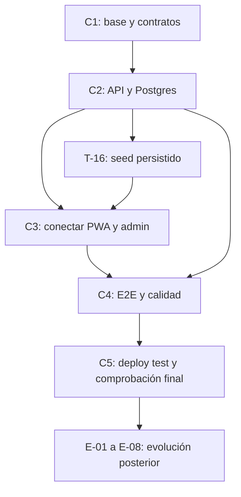

# MAUI — Plan de implementación directa y entrega en test

> **Fuente única del estado global.** Actualización: **2026-10-03**.
> **Método:** implementaciones directas con Codex y Claude Code. SDD deja de ser requisito del proyecto.
> **Entregable:** ambiente de test desplegado con seed reproducible y flujo funcional equivalente al de producción.
> **Stack inicial:** Vercel Functions + Neon Postgres + Drizzle. Destino de escala: AWS Lambda.

## Alcance y definición de entrega

Las dos listas separan lo ya construido de las implementaciones pendientes. El seed puede reutilizar el catálogo y los datos de los mocks actuales, pero se carga en la BD de test y se consume mediante la API real. PWA y admin usan los mismos contratos, autenticación, permisos, cálculos y transiciones que se usarán en producción.

La equivalencia con producción se refiere al flujo funcional y a los componentes de la aplicación. Cambian datos, URLs, credenciales, recursos y destinos de integraciones por entorno. El frontend de test debe compilar con servicios reales; una pantalla conectada a mocks o pedidos sincronizados por `localStorage` no cumple el entregable. El carrito y preferencias locales sí pueden conservar su persistencia en navegador.

**Fuera de este plan:** acuerdos, reuniones, selección de clientes, pruebas humanas, carga de surtido comercial, validación comercial de precios, entrenamiento, domicilios físicos, preparación de números/SIM y lanzamiento comercial. No se exige procesar 50 pedidos reales ni esperar un piloto para completar el desarrollo. Los antecedentes de producto se conservan en sus documentos; no son dependencias de la entrega técnica.

**Simplificación confirmada por el usuario:** seguimiento y comprobante dentro de PWA/admin; contacto WhatsApp mediante enlaces `wa.me` con texto preparado, reutilizando las capacidades existentes. Mensajería automática, Evolution API/VPS, outbox/jobs de envío y verificación WhatsApp quedan fuera de T-01 a T-24. Test y producción comparten este flujo sencillo; no se exige un gateway ni envío externo para cerrar la entrega.

**Imágenes por etapas, confirmado el 2026-10-02:** validar el MVP con menos productos, imágenes comprimidas y Vercel Blob dentro de sus cuotas gratuitas (T-09). Migrar las imágenes a Cloudflare R2 para la primera versión estable (E-08), conservando la interfaz portable de storage; la aplicación puede seguir en Vercel y la BD en Neon/Postgres. Decisión y condiciones en [ADR-001, imágenes por etapas](adr-001-stack-backend.md#imágenes-por-etapas--decisión-confirmada-el-2026-10-02).

**Forma de ejecución:** tomar un bloque, revisar dependencias y código existente, implementar directamente, validar y actualizar aquí la evidencia. No crear features SDD, specs por fases ni `tasks.json` como trámite. `tech/features/` y el backlog antiguo son referencias históricas. Codex y Claude Code comparten el plan y deben coordinar archivos para evitar sobrescribir cambios.

**Orquestación IA:** Codex administra los bloques, sesiones y validación de ambos asistentes siguiendo [la estrategia de sesiones y consumo](orquestacion-ia.md). Un ejecutor por defecto; contexto mínimo, IDs explícitos al reanudar, checkpoints breves y reparto según cuota disponible. Implementar con suscripciones Codex Plus/Claude Pro; no activar cobro API ni créditos adicionales.

**Calidad y bloqueos:** clean code es criterio de cierre de todos los bloques: responsabilidades claras, contratos tipados, validación de entradas, errores explícitos y lógica portable. Modelo/esfuerzo explícitos por complejidad; ninguna variante Luna ni Haiku, incluidos fallbacks. Si hace falta aclaración, conexión o autenticación del usuario, interrumpir el trabajo dependiente y avisar con evidencia y acción mínima; sin ciclos de reintento ni mocks para ocultar bloqueos. Capacidades y accesos comprobados en la [auditoría de herramientas](auditoria-herramientas.md).

**Estados:** pendiente, parcial, por verificar, en curso, bloqueado, hecho y condicionado. Un avance disponible en una feature todavía no incorporada se identifica por rama/commit; no se declara completado en la base. **Prioridades:** P0 = imprescindible para la entrega en test; P1 = calidad técnica incluida; P2 = evolución posterior. T-03 conserva su ID padre y se divide en T-03a/T-03b. No hay nuevas tareas aprobadas de infraestructura comercial.

## Contratos y diferencias aceptadas frente a la demo — 2026-10-02

- **Destacados:** la demo usa productos con `inStock`, no una selección editorial persistida. T-18 obtiene destacados del catálogo público real, conserva el orden del servidor y muestra hasta cuatro productos disponibles. No se añade un campo `featured` ni una API nueva en T-07.
- **Grupos de negocio:** Comprar/Servicios/Comunidad contienen accesos a verticales futuras, fuera del mercado de la tienda actual. Es una diferencia aceptada de esta entrega: en modo real se omiten esos grupos y sus tarjetas «Próximamente»; no se consumen mocks ni se prometen comercios/servicios inexistentes. El catálogo y sus categorías de productos sí son reales. Expansión: E-06.
- **Historial del cliente:** T-11 ya expone `q/status/from/to/limit/cursor` con alcance fijado por la sesión. T-18 acepta y valida la query compartida y la envía al backend antes de filtrar/paginar ([PR #25](https://github.com/NixonGamboa/marketplace/pull/25)); no descargar todas las páginas para simular filtros ni aceptar otro cliente por `userId`. Esto conecta un contrato existente, sin ampliar T-07.

Estos criterios rigen T-18/T-22/T-24. Si se solicita selección editorial o administración de grupos persistidos, se reabre T-07 como incremento separado, con un único escritor de contratos/schema/seed; no se agrega en paralelo a consumidores.

## Prioridad 0 — Reconciliación completada

Base funcional incorporada en develop: T-03a. Evidencia integrada y CI posterior: [PR #1](https://github.com/NixonGamboa/marketplace/pull/1). Las apps incorporan servicios reales en T-17/T-18; el build unificado conserva modo demo hasta T-23.

La historia original está preservada en el tag remoto `archive/checkout-contacto-pesos-whatsapp-20261001`; ramas fusionadas, worktrees temporales y stash integrado retirados. Se conserva la entrega independiente `feature/ajustes-presentacion-leche-y-miel` (`b95a0f2`), pendiente de integración. Política única: [Gitflow](orquestacion-ia.md#gitflow-y-separación-de-entregas).

## Lista 1 — Pasos ya hechos

| ID | Avance | Estado real y límite | Evidencia |
|---|---|---|---|
| H-01 | Producto, arquitectura general y límites del MVP definidos | Base documentada; intención de compra y pago contra entrega, sin pasarela ni POS integral | [Contexto](../../MAUI-PWA-customers/MAUI-CONTEXT.md), [RFC histórico](rfc-001-demo-validacion.md) |
| H-02 | Sistema visual, marca y componentes base | Reutilizables en ambas apps; no requieren rehacer diseño para conectar API | [Design System](../../MAUI%20Design%20System/README.md), estilos/componentes front |
| H-03 | PWA: Home, pasillos, catálogo, búsqueda y detalle | Catálogo público real conectado en T-18; demo conservada | `MAUI-PWA-customers/src/features/catalog/` |
| H-04 | Carrito persistente, cantidades y peso solicitado | Carrito local; precio y disponibilidad autoritativos del servidor, conexión real T-18 | `cartStore.ts`, `QuantityStepper.tsx`, `VariableWeightSheet.tsx` |
| H-05 | Checkout, recogida/domicilio, GPS/texto, franja, sustitución y confirmación | Checkout real con cuenta, entrega, confirmación e idempotencia; demo conservada; E2E navegador T-22 | `e567067`; `CheckoutPage.tsx`, `DeliverySelector.tsx`, `checkoutStore.ts`, `shipping.ts` |
| H-06 | PWA: historial, detalle, timeline, perfil, acceso y contacto del aliado | Auth, historial, perfil y contacto reales en T-18; polling T-19; repetir pedido en E-03 | `e567067`; `authStore.ts`, `OrderDetailPage.tsx`, `OrdersPage.tsx`, `useMerchantWhatsApp.ts` |
| H-07 | Admin: shell responsive, login, guard y roles | Auth y roles reales en T-17; demo conservada | `maui-admin-front/src/auth/`, `types/auth.ts`, shell |
| H-08 | Admin: listado/filtros, detalle, pesos reales, cancelación, contacto y picking | Reglas servidor T-12 y UI real T-17; alertas entre dispositivos T-19 | `e567067`; `features/orders/`, `mockOrderRepository.ts` |
| H-09 | Admin: productos/categorías, agotados, horarios y configuración | Servicios persistentes y selector de upload conectados en T-17; E2E navegador T-22 | `e567067`; `features/catalogo/`, `categorias/`, `tienda/`, `configuracion/` |
| H-10 | Admin: dashboard, histórico y auditoría | Dashboard, histórico y auditoría conectados a API en T-17 | `features/dashboard/`, `historico/`, `auditoria/` |
| H-11 | Baseline compartido y control de drift frontend | 16 productos de seed persistente T-16; contratos y drift comprobados | `a577111`; [Baseline](../../shared/catalog/README.md), `shared/contracts/`, `scripts/check-types-drift.sh` |
| H-12 | Build/origen unificado y exclusión de admin en service worker | PWA `/` y admin `/admin/` servidos públicamente; intercambio demo limitado al mismo navegador | `scripts/merge-unified-build.mjs`, `vercel.json`, `vite.config.ts` |
| H-13 | Stack inicial y scaffold portable | `domain/usecases/infra`, adapters memory/Postgres y handlers Vercel en `api/` raíz | [ADR](adr-001-stack-backend.md), [backend](../../maui-back/README.md) |
| H-14 | Núcleo de pedidos y migración inicial | Pedidos, listado, auth, idempotencia y transiciones persistentes incorporados; E2E integral T-22 | `api/`, `maui-back/src/`, migración inicial |
| H-15 | Provisionamiento y accesos cloud de test | GitHub, Vercel y Neon dev accesibles; aislamiento/CI posteriores completados | [PR #1](https://github.com/NixonGamboa/marketplace/pull/1), [auditoría](auditoria-herramientas.md) |
| H-16 | Base demo reconciliada y verificada | Base demo conservada y apps reales T-17/T-18; E2E navegador T-22 pendiente | Base de [PR #1](https://github.com/NixonGamboa/marketplace/pull/1) |
| H-17 | T-01/T-02/T-04: API test, aislamiento y contratos | Servidor y apps reales incorporados; E2E y despliegue final T-22/T-23 pendientes | [PR #1, base C1](https://github.com/NixonGamboa/marketplace/pull/1) |
| H-18 | CI reproducible y cuentas/sesiones reales | Auth servidor y pantallas reales T-17/T-18 incorporadas | [PR #1](https://github.com/NixonGamboa/marketplace/pull/1), [cierre PR #2](https://github.com/NixonGamboa/marketplace/pull/2) |
| H-19 | Autorización de pedidos por cliente y tienda | Autorización y listado servidor consumidos por apps T-17/T-18 | [PR #3](https://github.com/NixonGamboa/marketplace/pull/3), [cierre PR #4](https://github.com/NixonGamboa/marketplace/pull/4) |
| H-20 | Catálogo por tienda y reglas de entrega | Servidor, seed T-16 y apps T-17/T-18 incorporados | [PR #5](https://github.com/NixonGamboa/marketplace/pull/5), [cierre PR #7](https://github.com/NixonGamboa/marketplace/pull/7) |
| H-21 | Upload de fotos de catálogo | Servidor/Blob test y selector real T-17 incorporados; E2E navegador T-22 | [PR #10](https://github.com/NixonGamboa/marketplace/pull/10), [cierre PR #11](https://github.com/NixonGamboa/marketplace/pull/11) |
| H-22 | Creación autoritativa e idempotencia de pedidos | Creación servidor y cliente real T-18; reintento tras pérdida de respuesta validado | [PR #8](https://github.com/NixonGamboa/marketplace/pull/8) |
| H-23 | Listado e histórico autorizado | Listado e histórico servidor y UI T-17/T-18 incorporados | [PR #13](https://github.com/NixonGamboa/marketplace/pull/13) |
| H-24 | Ciclo de pedidos, pesos y sustituciones | Servidor con versiones y UI T-17/T-18 incorporados; regresión integral T-15/T-22 | [PR #18](https://github.com/NixonGamboa/marketplace/pull/18) |

## Lista 2 — Implementaciones pendientes en orden de ejecución

### A — Base técnica y contratos

**Entrega parcial:** backend accesible en test, entornos separados y contrato único. Prioridad 0 y T-03a completados; T-01/T-02 pueden comenzar sin contrato nuevo. T-03b requiere T-02 y T-03a.

| ID / prioridad | Implementación y estado | Depende de | Criterio de cierre |
|---|---|---|---|
| T-01 / P0 | API accesible en el despliegue de test — hecho; [PR #1](https://github.com/NixonGamboa/marketplace/pull/1) | H-12, H-13 | API/health conectados a BD test, errores JSON y rutas pedidos/SPAs operativas en Preview identificado. |
| T-02 / P0 | Configuración y aislamiento de test — hecho en Preview/develop; [PR #1](https://github.com/NixonGamboa/marketplace/pull/1) | H-15 | Node/variables/BD de test aislados y guards efectivos. Production conservada. Storage/upload: T-09. |
| T-03a / P0 | Checkout, lint y comprobaciones locales — hecho; base de [PR #1](https://github.com/NixonGamboa/marketplace/pull/1) | H-16 | Checkout reconciliado, tipos de ambas apps, lint, pruebas, drift y build. Modo real: T-17/T-18/T-23. |
| T-03b / P0 | CI reproducible — hecho; [PR #1](https://github.com/NixonGamboa/marketplace/pull/1) | T-02, T-03a | CI con Node/env fijados; tipos reales de cada app, lint, pruebas y contratos antes del build. |
| T-04 / P0 | Contratos compartidos y validación runtime — hecho; base C1 de [PR #1](https://github.com/NixonGamboa/marketplace/pull/1) | H-11, H-14 | DTO/esquemas/mappers compartidos y validación runtime. Lectura legacy conservada. Idempotencia T-10 y atomicidad T-12. |
| T-05 / P0 | Acceso y sesiones admin/cliente — hecho en servidor; [PR #1](https://github.com/NixonGamboa/marketplace/pull/1), [cierre PR #4](https://github.com/NixonGamboa/marketplace/pull/4); UI T-17/T-18 | T-02, T-04 | Resolver auth con JWT propio o provider del ADR en función de lo mínimo necesario. Sesión, expiración, logout y permisos reales; acceso privado del cliente a sus pedidos. Capturar nombre/teléfono sin fingir verificación. Test usa el mismo mecanismo con cuentas/credenciales de test; Magic Link avanzado queda en E-02 |

### B — Persistencia y API completa

**Entrega parcial:** datos, seguridad y reglas de negocio reales comprobables por HTTP. Las interfaces existentes se amplían donde haga falta.

| ID / prioridad | Implementación y estado | Depende de | Criterio de cierre |
|---|---|---|---|
| T-06 / P0 | Autorización y aislamiento por tienda — hecho; [PR #3](https://github.com/NixonGamboa/marketplace/pull/3), [cierre PR #4](https://github.com/NixonGamboa/marketplace/pull/4) | T-01, T-02, T-04, T-05 | Login/logout/sesión efectivos; denegar operaciones sin rol válido. Actor y tienda derivados de credenciales, no del body; endpoints existentes autorizados; listado T-11 debe aplicar esta política. Controles de origen/CSRF según sesión elegida y rate limits adecuados al runtime stateless; `userId`, teléfono o ULID no autorizan por sí solos |
| T-07 / P0 | Catálogo por tienda — hecho en servidor; [PR #5](https://github.com/NixonGamboa/marketplace/pull/5); seed T-16 y UI T-17/T-18 | T-04, T-06 | Schema/migraciones/repositories y API; lecturas públicas y CRUD protegido, agotado/activo, archivado sin perder histórico. Impedir borrar categoría con productos; unidades, moneda y precio/kg coherentes. Reutilizar baseline como datos, sin convertirlo en fuente permanente de la UI |
| T-08 / P0 | Configuración de tienda y entrega — hecho en servidor; [PR #5](https://github.com/NixonGamboa/marketplace/pull/5); seed T-16 y UI T-17/T-18 | T-04, T-06 | Nombre/contacto/dirección, horario/override, franjas/cobertura, envío/umbral gratis persistidos y consumibles por ambas apps. Valores iniciales provienen de seed configurable. `America/Bogota` explícita; servidor valida cierre/corte y disponibilidad de entrega. Cobertura: nota pequeña «Solo hay cobertura en el casco urbano de Dolores», GPS opcional por decisión del usuario; sin geocerca ni selector adicional; recogida sin costo de domicilio |
| T-09 / P0 | Storage y upload de imágenes — hecho en servidor; [PR #10](https://github.com/NixonGamboa/marketplace/pull/10), [cierre PR #11](https://github.com/NixonGamboa/marketplace/pull/11); UI T-17 | T-02, T-06, T-07 | Vercel Blob con adapter portable para validar el MVP con un catálogo reducido dentro de las cuotas gratuitas; upload real de archivo/cámara a storage de test, formato/peso/permiso validados, compresión y referencia persistida. Seed puede usar imágenes actuales; upload se prueba con fixture estable, sin esperar fotografías comerciales. Migración posterior a R2 en E-08 |
| T-10 / P0 | Creación de pedido confiable e idempotencia — hecho en servidor; [PR #8](https://github.com/NixonGamboa/marketplace/pull/8); cliente real T-18 | T-04, T-06, T-07, T-08 | Consultar catálogo servidor para precio/nombre/unidad/stock/peso variable; snapshots históricos; validar cantidad, teléfono y entrega. Calcular subtotal/envío/estimación en backend. Idempotencia persistente ante doble clic/timeout/reintento; no confiar en precio del cliente |
| T-11 / P0 | Listado, detalle e histórico real — hecho en servidor; [PR #13](https://github.com/NixonGamboa/marketplace/pull/13); UI T-17/T-18 | T-06, T-10 | Endpoints tienda/cliente, búsqueda/filtros de fecha/estado y paginación estable con desempate por ID. Detalle autorizado; timestamps ISO normalizados; pruebas con varias filas de igual fecha. Reutilizar `listByStore`, completando endpoint y reglas de acceso |
| T-12 / P0 | Ciclo completo, pesos y sustituciones — hecho en servidor; [PR #18](https://github.com/NixonGamboa/marketplace/pull/18); UI T-17/T-18 | T-10, T-11 | Máquina de estados única: preparación, pesos reales, total final, sustitución/quitar ítems, listo, entrega/recogida, entregado y cancelado con motivo. Conservar estimación inicial; validar pesos/transiciones en servidor; cambios atómicos por versión/estado esperado; pedidos terminales inmutables. **Cierre solo con pruebas contra API y Postgres reales en test** (transiciones, pesos, concurrencia y permisos por HTTP); mocks, memory o demo no cierran el bloque |
| T-13 / P0 | Auditoría persistente y trazabilidad — hecho en servidor ([PR #20](https://github.com/NixonGamboa/marketplace/pull/20)) | T-06, T-07, T-08, T-12 | Mutaciones registran actor/tienda/entidad/acción/fecha; lectura protegida. Coherencia entre cambio y auditoría ante fallo, sin confiar en `by` del frontend. ID pedido correlaciona logs/mensajes sin registrar secretos ni datos personales innecesarios |
| T-14 / P0 | Comprobante y contacto sencillo — servicios y componentes reales hechos ([PR #22](https://github.com/NixonGamboa/marketplace/pull/22)); integración UI T-17/T-18 | T-04, T-08, T-10, T-12 | Reutilizar enlaces/contacto actuales y preparar resumen del pedido con ID, estado, desglose y estimado/final según DTO real. PWA contacta al negocio configurado; admin al cliente del pedido. Normalizar teléfono y codificar texto; ocultar contacto inválido sin impedir compra/seguimiento. Estado y comprobante están disponibles dentro de las apps. Probar contenido/destino del enlace sin enviar mensajes; integrar UI en T-17/T-18. Sin gateway ni registro ficticio de entrega. **Cierre solo contra API y Postgres reales en test:** comprobante y fuente del contacto leídos del backend persistente; mocks, memory, localStorage o demo no cierran el bloque |
| T-15 / P0 | Tests de Postgres, HTTP y contratos — validado en [PR #28](https://github.com/NixonGamboa/marketplace/pull/28); integrado y CI aprobado | T-07, T-08, T-10, T-11, T-12, T-13, T-14 | BD aislada y fixtures; migraciones, JSONB/timestamps, auth/roles, filtros/paginación, idempotencia, concurrencia, errores HTTP y contenido del comprobante comprobados. Las 9 pruebas memory existentes se conservan y complementan; no sustituyen Postgres |

### C — Seed y conexión real de las apps

**Entrega parcial:** PWA y admin interactúan con la misma BD de test en navegadores/dispositivos independientes.

| ID / prioridad | Implementación y estado | Depende de | Criterio de cierre |
|---|---|---|---|
| T-16 / P0 | Seed reproducible e inicialización de test — completado: [PR #24](https://github.com/NixonGamboa/marketplace/pull/24) | T-02, T-04, T-06, T-07, T-08, T-12, T-13 | Transformar datos actuales a contratos reales e insertar catálogo/categorías, tienda/horarios/reglas, usuarios owner/operator/cliente y pedidos en estados representativos. Cubrir peso fijo/variable, agotado, recogida/domicilio, cancelado, estimado/final y audit. Seed idempotente; reset solo de BD aislada y con guard de entorno, nunca productiva; credenciales fuera del bundle. Identificar versión/fixtures y ejecutar tras migraciones |
| T-17 / P0 | Admin conectado a seis servicios reales — completado: adapters [PR #16](https://github.com/NixonGamboa/marketplace/pull/16); UI y API/Postgres [PR #23](https://github.com/NixonGamboa/marketplace/pull/23) | T-06 a T-14, T-16 | Implementar auth/orders/catalog/merchant/store/audit; loading/error/expiración/conflictos. Dashboard, filtros, histórico, pesos, cancelación, picking y upload usan backend; excluir simulador y reset local demo. Inicialización seed es servidor, no `runAllSeeds` en navegador |
| T-18 / P0 | PWA conectada a catálogo/tienda/checkout reales — completado: adapters [PR #17](https://github.com/NixonGamboa/marketplace/pull/17); UI y API/Postgres [PR #25](https://github.com/NixonGamboa/marketplace/pull/25) | T-04, T-05, T-07, T-08, T-10, T-11, T-16 | Sustituir hooks de `mockData` y stubs de orders; búsqueda/destacados derivados/detalle ven cambios backend; grupos de verticales futuras omitidos y filtros del historial transmitidos según los criterios de contrato anteriores. Perfil/contacto de test con acceso real a pedidos; teléfono viaja al backend. Checkout con envío, timeout y reintento idempotente; limpiar carrito solo tras confirmación comprobada; no login ficticio fuera del demo |
| T-19 / P0 | Alertas y seguimiento entre dispositivos — completado: [PR #26](https://github.com/NixonGamboa/marketplace/pull/26) | T-11, T-12, T-17, T-18 | Sustituir evento `storage` por polling API simple con deduplicación; ajustar PWA a 30–60 s configurable; pausar cuando corresponda y reconciliar tras background/red. Ver estados, cancelación y estimado/final; alertas y sonido activables, señal de fallo de actualización. No requiere WebSockets |
| T-20 / P0 | PWA, caché y conectividad limitada — hecho: [PR #29](https://github.com/NixonGamboa/marketplace/pull/29), CI aprobado | T-18, T-19 | Validar service worker generado: API no cae a SPA ni conserva datos privados entre usuarios. Caché selectiva de catálogo, sin reenviar mutaciones; offline muestra antigüedad y recupera estado. Manifest efectivo único, assets/iconos/tags Apple, instalación/update y responsive verificables técnicamente. Reducir imágenes/precache histórico ~26 MB y medir 3G/accesibilidad |
| T-21 / P1 | Observabilidad y recuperación técnica — validación final en [PR #30](https://github.com/NixonGamboa/marketplace/pull/30); restore real aprobado, Preview/CI final pendientes | T-02, T-13, T-17, T-18 | Errores PWA/admin/API y logs correlacionados; métricas básicas de pedidos/duplicados/latencia/errores. Export/backup y prueba de restore en test; reversión de versión compatible con schema. Diagnóstico/guía de ejecución técnica y export de catálogo; no exige equipo humano de soporte |

### D — Validación automatizada y entrega desplegada

**Entrega final:** versión real de ambas apps desplegada en test, cargada con seed y comprobada contra sus servicios reales.

| ID / prioridad | Implementación y estado | Depende de | Criterio de cierre |
|---|---|---|---|
| T-22 / P0 | E2E automatizado y fallos controlados — en curso: runner y smoke inicial en feature/runner-e2e-real; cierre completo tras T-15/T-20/T-21 | T-03a, T-03b, T-15 a T-21 | Dos contextos independientes cliente/admin usando API y BD reales. Compra seed → recepción admin → pesos/sustitución → total final → entrega/cancelación → histórico/audit/comprobante. Incluir permisos/sesiones, cierre/agotado, manipulación de precios, doble submit, timeout tras persistir, 3G/offline y recuperación; comprobar destino/texto de enlaces sin enviar WhatsApp. Pruebas ejecutadas por herramientas/agentes, sin reclutar usuarios |
| T-23 / P0 | Build real y despliegue de test — pendiente | T-01, T-02, T-03a, T-03b, T-15, T-16, T-22 | Quitar `--mode demo` forzado del flujo de entrega unificado; ambas apps en servicios reales y API en mismo host. Desplegar versión identificable, aplicar migraciones y seed en recursos de test; comprobar fixtures/cuentas y rutas profundas. URL accesible al usuario con acceso adecuado al entorno; documentar configuración y modo de restaurar seed |
| T-24 / P0 | Comprobar y entregar el ambiente de test — pendiente | T-23 | Repetir smoke/E2E contra la URL desplegada, no solo local; validar persistencia tras recarga/nueva sesión, edición catálogo visible en PWA, flujo completo, comprobante y enlaces de contacto. Entregar URL, versión, comandos de setup/seed/reset, acceso de cuentas de test por canal adecuado y resultados de pruebas. Cerrar sin gateway externo, acuerdos ni validaciones humanas |

### Evolución técnica posterior — separada del entregable de test

Estos bloques conservan la visión del resto del sistema. Se ejecutan después de T-24 cuando se solicite la capacidad correspondiente; no retrasan la entrega actual ni dependen de tareas operativas.

| ID / prioridad | Capacidad y estado | Dependencia técnica | Alcance de implementación |
|---|---|---|---|
| E-01 / P2 | Fotos privadas de pedido/evidencia de pesos — condicionado | T-09, T-12, T-17, T-19 | Upload privado, acceso/retención, cámara/fixtures, referencia en pedido/audit e histórico/picking/tracker; resolver DEBT-001 sin exigir S3 ahora |
| E-02 / P2 | Acceso cliente verificado por WhatsApp — condicionado | T-05, T-06, E-07 | Magic Link/OTP con uso único, expiración, sesiones seguras y límites de abuso; integración sandbox/test del mismo proveedor, migración de perfiles v1 |
| E-03 / P2 | Recurrencia, capacidad y servicio — condicionado | T-11, T-12, T-18, T-19 | Implementaciones separadas: repetir pedido como plantilla editable, slots/cupos, devoluciones/incidencias trazables, Web Push y realtime si se solicita. Búsqueda/detalle/historial existentes se amplían, no se reconstruyen |
| E-04 / P2 | UX y eficiencia del build — parcial/condicionado | T-20, T-23 | Dark mode completo antes de habilitar toggle; optimización workspaces/locks/deps duplicadas. Ofertas/favoritos y nuevas verticales siguen sin implementación; requieren alcance técnico definido para ejecutarse |
| E-05 / P2 | Migración de runtime a AWS Lambda — condicionado | T-24 | Adapter HTTP/API Gateway, composición/env/IaC, permisos/observabilidad, prueba de equivalencia, corte y rollback. Mantener Postgres si conviene; cambios de BD/storage/auth son decisiones independientes. No crear adapters vacíos ni infraestructura AWS ahora |
| E-06 / P2 | Plataforma multi-aliado y módulos adicionales — condicionado | T-06, T-13, T-24 | Aislamiento probado, administración de tenants/cuentas/catálogos, branding por tienda; módulos separados de comisiones/wallet, pedidos para terceros, asignación de entregas/cierre de efectivo y campañas si se solicitan. Solo desarrollo técnico; sin contratos, reuniones, onboarding humano ni SLAs operativos |
| E-07 / P2 | Mensajería automática — condicionado | T-12, T-13, T-24 | Solo si se solicita después: elegir proveedor disponible, adapter portable, eventos/outbox persistente, deduplicación y reintentos compatibles con runtime; validar integración real en sandbox/test. Evolution API es antecedente, no obligación de contratar VPS ni herramienta necesaria ahora |
| E-08 / P2 | Migración de imágenes a Cloudflare R2 — prevista para la primera versión estable | T-09, T-24 | Adapter sobre la interfaz de storage; verificar habilitación, cuotas y costos vigentes, copiar imágenes y actualizar referencias persistidas sin cambiar IDs ni contratos de negocio; validar acceso real, integridad y rollback. Aplicación en Vercel y BD en Neon/Postgres; no habilitar R2 ni crear adapters vacíos ahora |

## Orden de entrega y dependencias

| Corte | Bloques | Resultado demostrable |
|---|---|---|
| C1 — Base técnica | T-01 a T-05 | API accesible, entorno aislado, checkout sin error, contratos y acceso definidos |
| C2 — API persistente | T-06 a T-16 | Catálogo/tienda/pedidos/roles/auditoría/comprobante y seed comprobables sobre BD real |
| C3 — Apps conectadas | T-17 a T-19 | Flujo cliente/admin entre contextos independientes; cambios persistentes visibles en ambos |
| C4 — Calidad técnica | T-20 a T-22 | Caché/3G/offline, trazabilidad/restore y E2E completos |
| C5 — Entrega en test | T-23 y T-24 | URL desplegada, seed reproducible, servicios reales y pruebas sobre ese despliegue |

**Ruta crítica:** T-04/T-05 → T-06 → T-07/T-08 → T-10 → T-11/T-12 → T-16 → T-17/T-18 → T-19 → T-22 → T-23 → T-24. T-01/T-02 habilitan la infraestructura; T-09/T-13/T-14 y T-15/T-20/T-21 convergen antes de E2E/entrega. T-14 reutiliza contacto por enlaces y datos de pedido; no necesita credenciales WhatsApp. La mensajería automática solo se considera en E-07.

T-01 a T-13 están cerrados en servidor y T-14 tiene servicios/componentes reales validados; sus PRs están en [Evidencia de bloques cerrados](#evidencia-de-bloques-cerrados). T-16/T-17/T-18 están incorporados y validados con API/Postgres real. T-19 completa seguimiento entre sesiones; T-15 y T-20/T-21 convergen antes de T-22/T-23/T-24.

## Divergencias de partida y resolución del contrato (T-04)

La tabla conserva el diagnóstico previo al incremento `a577111`. DTOs, enums, pesos, totales y validación están reconciliados en la feature; contexto confiable, permisos y autoridad de catálogo/envío se completan en T-06/T-07/T-08/T-10. La integración persistente se valida en T-15.

| Concepto | PWA/admin actual | Backend actual | Resultado necesario |
|---|---|---|---|
| IDs/tienda | `orderId/userId`, merchant en sesión local | `id/customerId/storeId` desde body | DTO único y contexto confiable |
| Estados | `received/confirmed/preparing/ready/delivered`; cancelación como campo extra | `received/preparing/ready/in_delivery/delivered/cancelled` | Máquina común y UI/mensajes para cada modalidad/estado |
| Sustitución | `call_me/similar/remove` | `ask/allow/none` | Valores y significado únicos |
| Ítems/pesos | `id/qty/is_variable_weight/kilosRequested/kilosReal` | `productId/quantity/isVariableWeight/kilos` | Peso solicitado/real, cantidades y snapshots coherentes |
| Totales | `estimatedTotal` preservado, `finalTotal` separado y `shippingCost` en mock | `total` solo suma ítems | Estimación original, final, envío y redondeo COP servidor |
| Teléfono | `OrderPayload.customerPhone` normalizado desde checkout | Campo requerido | Contrato común y validación/transmisión servidor |
| Entrega | `deliveryType/deliveryData`, GPS y slot | `deliveryMode/deliveryAddress` string | Preservar GPS/texto/franja y reglas por modalidad |
| Lecturas/permisos | `list(userId?)` y persistencia local | GET por ID sin auth | Acceso privado, filters/cursor y errores compartidos |
| Fechas | Suposición de strings ISO | Drizzle timestamp `mode: string` | ISO UTC normalizado en DTO y pruebas de BD |

## Bloqueantes técnicos y decisiones mínimas

| Hallazgo / necesidad | Bloques que lo resuelven | Límite actual |
|---|---|---|
| Sesiones y autorización de pedidos consumidas por apps reales | T-05/T-06/T-17/T-18 | [PR #3](https://github.com/NixonGamboa/marketplace/pull/3); consumidores reales T-17/T-18 |
| Autoridad de creación e idempotencia resueltas en servidor | T-10/T-12/T-18 | [PR #8](https://github.com/NixonGamboa/marketplace/pull/8); cliente real T-18 incorporado; transiciones atómicas [PR #18](https://github.com/NixonGamboa/marketplace/pull/18) |
| Atomicidad de estados y catálogo hecha; regresión integral pendiente | T-12/T-15 | [PR #18](https://github.com/NixonGamboa/marketplace/pull/18); ampliar pruebas integrales en T-15 |
| Apps conectadas; seguimiento entre dispositivos y build real pendientes | T-17/T-18/T-19/T-23 | Flag por sí solo no conecta el sistema |
| Seed servidor reproducible y reset acotado comprobados | T-15 | [PR #28](https://github.com/NixonGamboa/marketplace/pull/28) |
| T-16 | [PR #24](https://github.com/NixonGamboa/marketplace/pull/24); fixtures consumidos por API real |
| Upload de catálogo hecho en servidor; auth solo Preview/develop | T-09, T-17, E-08 | [PR #10](https://github.com/NixonGamboa/marketplace/pull/10), [cierre PR #11](https://github.com/NixonGamboa/marketplace/pull/11); UI real T-17, R2 en primera versión estable |
| Contacto actual debe usar datos persistentes y teléfonos correctos | T-08/T-14/T-17/T-18 | `wa.me` existente es suficiente; no depende de Evolution API ni envío automatizado |
| Gates automatizados en CI; E2E de negocio pendiente | T-22/T-23 | T-03b hecho: Actions ejecuta tipos explícitos, lint, tests y drift antes del build; no acredita el ciclo de negocio |
| Integración Postgres y E2E de negocio incompletos | T-15/T-22/T-24 | Migración/lectura legacy y smoke reales comprobados; no sustituyen fixtures, permisos, idempotencia/concurrencia ni ciclo completo |

El hosting comercial y sus condiciones corresponden a una salida productiva posterior; no son un gate de este entregable de test. Mantener las restricciones registradas en el ADR y verificar que el uso efectivo y las cuotas del ambiente de test son compatibles, sin contratar ni cambiar de proveedor por anticipación.

## Paridad funcional y seed: criterios de aceptación finales

- Build PWA/admin de servicios reales, con mismos contratos y reglas que producción; API JSON funcional en la URL entregada.
- Migraciones y seed ejecutables/repetibles sobre BD aislada. Dataset actual admitido; imágenes y precios son fixtures de test, no compromisos comerciales.
- Cuentas de test autentican con mecanismo real; roles y permisos se aplican en backend. Auth ficticia de navegador no acredita paridad.
- Cliente crea pedido, admin lo consulta/actualiza desde otra sesión, captura pesos/sustituciones, obtiene total final y lo entrega/cancela. Histórico, dashboard y audit persisten tras recarga.
- Admin crea/edita/desactiva producto, sube imagen y cambia tienda/horarios; PWA refleja esos cambios sin deploy ni localStorage compartido.
- Pedido no se duplica con doble clic/reintento/timeout; error conserva carrito; estado concurrente y tienda cerrada/agotados están controlados.
- Comprobante/estado se consultan dentro de las apps; enlaces de contacto usan los datos reales y texto preparado. Validación automatizada de contenido/destino sin envío WhatsApp; no simular envío ni prometer notificaciones automáticas. API/BD/storage sí se validan con servicios reales de test.
- Typecheck/lint, tests unitarios/integración y E2E críticos pasan; smoke/E2E se repite en el despliegue final y queda evidencia de versión/URL.
- Instrucciones técnicas para setup/seed/reset, configuración y acceso de cuentas de test entregadas sin publicar secretos.

## Portabilidad a AWS y mínima infraestructura inicial

Conservar **handlers delgados → usecases → interfaces → adapters** para BD/storage y futuras integraciones cuando se implementen. ULID, contexto de tienda, DTOs, snapshots, versiones y errores independientes del runtime. Vercel permanece como host inicial; Neon/Drizzle como persistencia. No añadir adapters vacíos de mensajería, SAM/CDK, DynamoDB, Cognito, microservicios, multi-región ni WebSockets a este entregable.

Las Functions son stateless: no usar arrays en memoria como BD compartida. Persistencia e idempotencia de pedidos son compatibles con el host; jobs/reintentos de mensajería se diseñarán solo al ejecutar E-07. La migración futura puede cambiar únicamente la entrada HTTP/composición y conservar Postgres; si se cambia BD/auth/storage, probar equivalencia y datos como trabajo adicional.

## Evidencia de bloques cerrados

| Bloque | PR o reporte |
|---|---|
| Base reconciliada, C1: T-01/T-02/T-04 | [PR #1 (base incorporada)](https://github.com/NixonGamboa/marketplace/pull/1) |
| C2: T-03b/T-05 | [PR #1](https://github.com/NixonGamboa/marketplace/pull/1), [cierre PR #2](https://github.com/NixonGamboa/marketplace/pull/2) |
| T-06 y cierre servidor T-05 | [PR #3](https://github.com/NixonGamboa/marketplace/pull/3), [cierre PR #4](https://github.com/NixonGamboa/marketplace/pull/4) |
| T-07/T-08 | [PR #5](https://github.com/NixonGamboa/marketplace/pull/5), [cierre PR #7](https://github.com/NixonGamboa/marketplace/pull/7) |
| T-09 | [PR #10](https://github.com/NixonGamboa/marketplace/pull/10), [cierre PR #11](https://github.com/NixonGamboa/marketplace/pull/11) |
| T-10 | [PR #8](https://github.com/NixonGamboa/marketplace/pull/8) |
| T-11 | [PR #13](https://github.com/NixonGamboa/marketplace/pull/13) |
| T-12 | [PR #18](https://github.com/NixonGamboa/marketplace/pull/18) |
| T-13 | [PR #20](https://github.com/NixonGamboa/marketplace/pull/20) |
| T-14 | [PR #22](https://github.com/NixonGamboa/marketplace/pull/22) |
| T-16 | [PR #24](https://github.com/NixonGamboa/marketplace/pull/24) |
| T-17 | [PR #16](https://github.com/NixonGamboa/marketplace/pull/16), [PR #23](https://github.com/NixonGamboa/marketplace/pull/23) |
| T-18 | [PR #17](https://github.com/NixonGamboa/marketplace/pull/17), [PR #25](https://github.com/NixonGamboa/marketplace/pull/25) |
| T-19 | [PR #26](https://github.com/NixonGamboa/marketplace/pull/26) |
| T-20 | [PR #29](https://github.com/NixonGamboa/marketplace/pull/29) |
| Publicador de reportes | [PR #6](https://github.com/NixonGamboa/marketplace/pull/6), [corrección PR #7](https://github.com/NixonGamboa/marketplace/pull/7) |

**Límites vigentes:** servicios y UI reales incorporados en T-17/T-18; build unificado demo hasta T-23. Test tiene tienda/catálogo/cuentas/pedidos de seed reproducible T-16. Corte de entrega configurable; seed conserva la configuración existente de tienda. Catálogo completo y listado de pedidos con paginación del servidor. T-11 aplica autorización al listado en servidor; consumo real incorporado en T-17/T-18. Cancelación customer sigue denegada; la cancelación de personal, transiciones, pesos y atomicidad están hechos en servidor (T-12). No se añade límite IP con headers no verificados. T-12/T-14 solo se cierran contra API/Postgres reales.

## Seguimiento vigente

Encargo nocturno 2026-10-03: reset/reseed permanente limitado a Neon dev/maui con guard T-16; restauración T-21 en rama temporal desde dev y borrado posterior; T-23 conserva build:demo y cambia entrega unificada a real; URL de test = Preview estable de develop sin dominio propio. T-24 se prepara completo sin entregar credenciales. Reset antes de cada corrida E2E completa. No Production ni cambios de plan/compras/auth sin intervención. Revisión posterior T-13 por Claude; revisión inicial de mismo proveedor aceptada como excepción por el usuario.

T-12 cerrado en servidor: [PR #18](https://github.com/NixonGamboa/marketplace/pull/18). Adapters T-17/T-18 incorporados mediante [PR #16](https://github.com/NixonGamboa/marketplace/pull/16) y [PR #17](https://github.com/NixonGamboa/marketplace/pull/17), con demo conservada y CI aprobado. Su conexión UI y validación API/Postgres están en [PR #23](https://github.com/NixonGamboa/marketplace/pull/23) y [PR #25](https://github.com/NixonGamboa/marketplace/pull/25); el seed está integrado en T-16.

T-13 cerrado en servidor: [PR #20](https://github.com/NixonGamboa/marketplace/pull/20). La auditoría comercial no incluye login/logout ni política de retención; lectura UI y adapter audit corresponden a T-17. T-14 completado: [PR #22](https://github.com/NixonGamboa/marketplace/pull/22); conexión UI en T-17/T-18. T-16 cerrado con seed, reset acotado, resembrado idempotente y smoke reales aprobados: [PR #24](https://github.com/NixonGamboa/marketplace/pull/24). Tienda, pedido previo y ledger conservados por SQL independiente. T-17 validado con API/Postgres real: [PR #23](https://github.com/NixonGamboa/marketplace/pull/23). T-18 validado con API/Postgres real: [PR #25](https://github.com/NixonGamboa/marketplace/pull/25). Seguimiento por API validado en [PR #26](https://github.com/NixonGamboa/marketplace/pull/26); caché/offline y build real unificado siguen en T-20/T-23.

T-17/T-18: smokes de servicios reales aprobados (7/7 y 6/6). No equivalen al E2E de navegador T-22 ni al build real unificado T-23. Contratos tienen un solo escritor; limpieza acotada del lote autorizada y comprobada por SQL: seed, pedido anterior, cuentas, catálogo, tienda y migraciones conservados.

Los snapshots de creación contienen los datos personales del pedido; una anonimización por UPDATE y la retención futura deben abarcar también `order_creations`. Borrar un pedido elimina su claim por cascada. No se añade una política de retención en T-10.

### Auditoría posterior T-13 y cobertura T-15 — 2026-10-03

[PR #28](https://github.com/NixonGamboa/marketplace/pull/28): revisión posterior Claude Sonnet/high, corrección de `currency` en auditoría y regresión; contratos serializados entre apps, migraciones y carreras CAS. Smoke contra Preview real/Neon: 5/5 escenarios, ocho peticiones por carrera y cuota 20/24; cleanup independiente preservó el pedido previo. El runner se corrige para cerrar sesiones también ante login parcial. Hallazgo de diagnóstico de auditoría pasa a T-21; el fallback opcional a actor system, orden temporal de commits y UI owner/API operator se conservan como límites conocidos, sin cambiar permisos.

### Caché y privacidad T-20 — 2026-10-03

[PR #29](https://github.com/NixonGamboa/marketplace/pull/29): revisión crítica cruzada Codex/Claude aprobada; headers de GET públicos separados de respuestas privadas y huella de intención SHA-256 sin datos personales. Chrome real contra Preview/Neon SHA6bfa17b:18/18, dos clientes sucesivos, caché pública efectiva, privado sin caché, offline con antigüedad, recuperación y API fuera de SPA; dos sesiones cerradas. Shell en3G2965ms (no equivale al tiempo de catálogo completo). CI local1164backend/270PWA/224admin ybuild aprobados; precache587,3KiB/SW22,2KiB. Avisos visuales preexistentes y Blob cross-origin sin caché quedan como límites; buildunificado real se completa en T-23.

### Observabilidad y recuperación T-21 — 2026-10-03

[PR #30](https://github.com/NixonGamboa/marketplace/pull/30): implementación Codex, revisión cruzada Claude Sonnet/high y corrección del observador aislado para no alterar un pedido confirmado. PWA/admin/API correlacionan requestId y errores sin datos personales ni driver/SQL; logs, métricas básicas y guía operativa. Restore real de las nueve tablas/schema/ledger del backup AES-256-GCM a un clon temporal de dev: huella idéntica, dev intacto y clon borrado. Blob no forma parte del backup Postgres. Confirmación de headers/logs contra Preview final y CI del head vigente pendientes.
