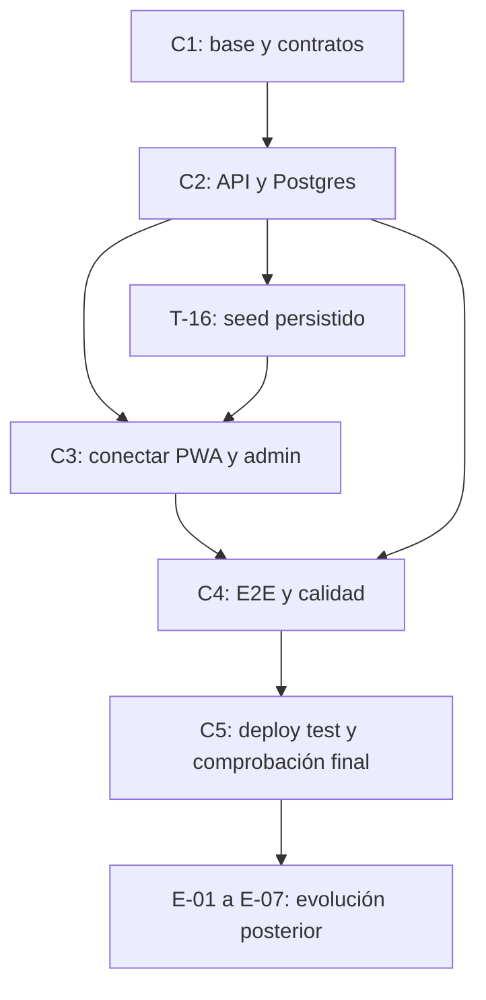

# MAUI — Plan de implementación directa y entrega en test

> **Fuente única del estado global.** Actualización: **2026-10-01**.
> **Método:** implementaciones directas con Codex y Claude Code. SDD deja de ser requisito del proyecto.
> **Entregable:** ambiente de test desplegado con seed reproducible y flujo funcional equivalente al de producción.
> **Stack inicial:** Vercel Functions + Neon Postgres + Drizzle. Destino de escala: AWS Lambda.

## Alcance y definición de entrega

Las dos listas separan lo ya construido de las implementaciones pendientes. El seed puede reutilizar el catálogo y los datos de los mocks actuales, pero se carga en la BD de test y se consume mediante la API real. PWA y admin usan los mismos contratos, autenticación, permisos, cálculos y transiciones que se usarán en producción.

La equivalencia con producción se refiere al flujo funcional y a los componentes de la aplicación. Cambian datos, URLs, credenciales, recursos y destinos de integraciones por entorno. El frontend de test debe compilar con servicios reales; una pantalla conectada a mocks o pedidos sincronizados por `localStorage` no cumple el entregable. El carrito y preferencias locales sí pueden conservar su persistencia en navegador.

**Fuera de este plan:** acuerdos, reuniones, selección de clientes, pruebas humanas, carga de surtido comercial, validación comercial de precios, entrenamiento, domicilios físicos, preparación de números/SIM y lanzamiento comercial. No se exige procesar 50 pedidos reales ni esperar un piloto para completar el desarrollo. Los antecedentes de producto se conservan en sus documentos; no son dependencias de la entrega técnica.

**Simplificación confirmada por el usuario:** seguimiento y comprobante dentro de PWA/admin; contacto WhatsApp mediante enlaces `wa.me` con texto preparado, reutilizando las capacidades existentes. Mensajería automática, Evolution API/VPS, outbox/jobs de envío y verificación WhatsApp quedan fuera de T-01 a T-24. Test y producción comparten este flujo sencillo; no se exige un gateway ni envío externo para cerrar la entrega.

**Forma de ejecución:** tomar un bloque, revisar dependencias y código existente, implementar directamente, validar y actualizar aquí la evidencia. No crear features SDD, specs por fases ni `tasks.json` como trámite. `tech/features/` y el backlog antiguo son referencias históricas. Codex y Claude Code comparten el plan y deben coordinar archivos para evitar sobrescribir cambios.

**Orquestación IA:** Codex administra los bloques, sesiones y validación de ambos asistentes siguiendo [la estrategia de sesiones y consumo](orquestacion-ia.md). Un ejecutor por defecto; contexto mínimo, IDs explícitos al reanudar, checkpoints breves y reparto según cuota disponible. Implementar con suscripciones Codex Plus/Claude Pro; no activar cobro API ni créditos adicionales.

**Calidad y bloqueos:** clean code es criterio de cierre de todos los bloques: responsabilidades claras, contratos tipados, validación de entradas, errores explícitos y lógica portable. Modelo/esfuerzo explícitos por complejidad; ninguna variante Luna ni Haiku, incluidos fallbacks. Si hace falta aclaración, conexión o autenticación del usuario, interrumpir el trabajo dependiente y avisar con evidencia y acción mínima; sin ciclos de reintento ni mocks para ocultar bloqueos. Capacidades y accesos comprobados en la [auditoría de herramientas](auditoria-herramientas.md).

**Estados:** pendiente, parcial, por verificar, en curso, bloqueado, hecho y condicionado. Un avance disponible en una feature todavía no incorporada se identifica por rama/commit; no se declara completado en la base. **Prioridades:** P0 = imprescindible para la entrega en test; P1 = calidad técnica incluida; P2 = evolución posterior. T-03 conserva su ID padre y se divide en T-03a/T-03b. No hay nuevas tareas aprobadas de infraestructura comercial.

## Prioridad 0 — Reconciliar la base antes de implementar

**Reconciliación completada el 2026-10-01:** el usuario aprobó incorporar parcialmente los nueve commits funcionales. Se prepararon en `feature/integracion-checkout-contacto-pesos` desde la base anterior `eeeeeeddb91b39251dced37ce169f337ba9dc495`, se corrigieron dos errores de tipos y se verificó el conjunto antes de incorporarlo a `develop` por fast-forward. **Base vigente:** `e5670671f404eb29e849a4eb13d68bb2c9f485e4`. La feature original `feature/checkout-contacto-pesos-whatsapp`, en `706ed8aad162e1fc1757e2bad44877353bdfcbe0`, se conserva como antecedente de los 12 commits comparados.

El Preview [marketplace-4l6m0bchh-infogamboatech-2785.vercel.app](https://marketplace-4l6m0bchh-infogamboatech-2785.vercel.app), deployment `dpl_7svLpXaTaHRtBnK4YVPNSNaEGiy7`, se creó el **2026-09-29 a las 18:45:53 America/Bogota**, desde esa feature y ese commit `706ed8a`. La API de Vercel confirmó `source=git`, `gitSource.ref/sha` y metadata GitHub. No salió de develop. El Preview mantiene mocks frontend y no acredita la entrega real completa.

| Área | Base anterior | Avance incorporado a develop | Estado vigente |
|---|---|---|---|
| H-05 / T-03a | Checkout con hook condicional, celular solo de perfil y limitaciones de GPS/envío | Hook antes del return; celular editable/normalizado, GPS primero con referencia alternativa, retiro sin envío; conserva snapshots/pesos solicitados | H-05 ampliado; T-03a hecho y verificado localmente |
| H-06 / T-14 | Contacto PWA con número estático | Contacto de aliado configurable en detalle/perfil/footer, oculto si inválido; aún lee localStorage admin | H-06 ampliado; T-14 parcial, pendiente fuente API, comprobante y copy coherente con contacto manual |
| H-08 / T-12 | Pesos mock sobrescriben estimado | `finalTotal` separado del estimado, incluye envío; pesos positivos/finitos y bloqueo ready; referencia/mapa en admin | H-08 ampliado; T-12 sigue parcial: faltan reglas servidor, atomicidad, permisos y estados completos |
| H-09 / T-14 | Configuración local | Validación del WhatsApp del aliado | H-09 ampliado; persistencia/upload y consumo API siguen pendientes |
| H-11 / T-04 | DTOs PWA/admin sin celular/envío en payload ni final separado | `customerPhone`, `shippingCost`, `finalTotal` alineados en ambos fronts | H-11 ampliado; T-04 parcial: no hay contrato shared/runtime/backend reconciliado |
| H-16 / T-03a | Verificación antigua no compiló explícitamente tsconfig.app | Conjunto parcial más correcciones: typecheck explícito de ambas apps, 17 tests PWA, 75 admin, drift, lint sin errores y build unificado pasan | Evidencia vigente en `e567067`; quedan tres warnings de lint por app y CI pendiente |

**Selección aprobada e incorporada:** `5ab4dde`, `89b1790`, `af95034`, `1558055`, `2662697`, `1b6fe90`, `981555c`, `b58d1cb`, `706ed8a`, en ese orden mediante cherry-pick. Incorporan soporte de tests, DTOs, checkout, cálculo mock, detalle/configuración/contacto y sustitución por defecto `call_me`. No tocan `api/`, `maui-back/`, `shared/` ni agregan CI. El flujo del commit `5c9855c` se concilia en la política única de [orquestación](orquestacion-ia.md#gitflow-y-separación-de-entregas), sin importar su versión vieja del plan.

**Excluidos de la incorporación:** `a6d5972` (eliminación de 77 archivos del Design System), `24c7410` (paleta púrpura del admin) y los documentos antiguos de `5c9855c`. Se mantiene el diseño de develop. La comparación total original abarcaba 107 archivos; la incorporación final abarca 26 archivos de PWA/admin, incluidos los dos ajustes de tipos.

**Gate completado:** en worktree aislado del conjunto parcial se ejecutaron `tsc --noEmit -p tsconfig.app.json` en ambas apps, lint, 17/17 tests PWA, 75/75 tests admin y drift de tipos frontend. Todos pasan; lint conserva tres warnings por app. Build PWA demo, build admin bajo `/admin/` e injerto unificado también pasan. `e567067` añade la referencia de tipos `vite-plugin-pwa/client` y retira la exportación duplicada de `VisibleConfig`, resolviendo TS2307/TS2484. Los otros tres errores antiguos se resuelven con los commits seleccionados. Se revisó que los scripts build/typecheck originales omiten la comprobación explícita de app; T-03b deberá ejecutar estos gates antes del build. El build todavía fuerza demo: cambiar servicios/entorno real pertenece a T-17/T-18/T-23.

**Decisión resuelta:** incorporación parcial aprobada y realizada localmente; también se aprobaron la separación documental/presentación y sus commits locales. No se autorizaron ni ejecutaron push o promoción a producción. El Preview del 29 de septiembre sigue en `706ed8a`; esta reconciliación local no lo redesplegó. H-* y estados siguientes describen ahora develop reconciliado, sin declarar API/auth/persistencia terminadas por avances de demo.

## Lista 1 — Pasos ya hechos

| ID | Avance | Estado real y límite | Evidencia |
|---|---|---|---|
| H-01 | Producto, arquitectura general y límites del MVP definidos | Base documentada; intención de compra y pago contra entrega, sin pasarela ni POS integral | [Contexto](../../MAUI-PWA-customers/MAUI-CONTEXT.md), [RFC histórico](rfc-001-demo-validacion.md) |
| H-02 | Sistema visual, marca y componentes base | Reutilizables en ambas apps; no requieren rehacer diseño para conectar API | [Design System](../../MAUI%20Design%20System/README.md), estilos/componentes front |
| H-03 | PWA: Home, pasillos, catálogo, búsqueda y detalle | Funcional en demo, datos importados desde código | `MAUI-PWA-customers/src/features/catalog/` |
| H-04 | Carrito persistente, cantidades y peso solicitado | Funcional en demo; el servidor aún debe validar precio/disponibilidad | `cartStore.ts`, `QuantityStepper.tsx`, `VariableWeightSheet.tsx` |
| H-05 | Checkout, recogida/domicilio, GPS/texto, franja, sustitución y confirmación | Demo con celular editable/normalizado, GPS primero y referencia alternativa, retiro sin envío, snapshots/pesos solicitados y `call_me` por defecto; conserva carrito ante fallo; reglas servidor pendientes | `e567067`; `CheckoutPage.tsx`, `DeliverySelector.tsx`, `checkoutStore.ts`, `shipping.ts` |
| H-06 | PWA: historial, detalle, timeline, perfil, acceso y contacto del aliado | Demo; contacto configurable en detalle/perfil/footer, oculto si inválido, aún desde localStorage admin. Acceso crea perfil local; polling 5 s; repetir mercado aún vacío | `e567067`; `authStore.ts`, `OrderDetailPage.tsx`, `OrdersPage.tsx`, `useMerchantWhatsApp.ts` |
| H-07 | Admin: shell responsive, login, guard y roles | Demo con `owner/operator` y sesión local; `viewer` quedó fuera del alcance anterior | `maui-admin-front/src/auth/`, `types/auth.ts`, shell |
| H-08 | Admin: listado/filtros, detalle, pesos reales, cancelación, contacto y picking | Demo con `finalTotal` separado de estimado e incluye envío; pesos positivos/finitos y bloqueo ready, referencia/mapa. Alertas/sonido e impresión/copia existentes; reglas servidor pendientes | `e567067`; `features/orders/`, `mockOrderRepository.ts` |
| H-09 | Admin: productos/categorías, agotados, horarios y configuración | CRUD local, WhatsApp del aliado validado; imágenes por URL/placeholder sin upload; persistencia y consumo API pendientes | `e567067`; `features/catalogo/`, `categorias/`, `tienda/`, `configuracion/` |
| H-10 | Admin: dashboard, histórico y auditoría | Demo sobre datos y auditoría locales | `features/dashboard/`, `historico/`, `auditoria/` |
| H-11 | Baseline compartido y control de drift frontend | **16 productos** reutilizables para seed; DTOs frontend alinean `customerPhone`, `shippingCost`, `finalTotal`. Tipos replicados coinciden; shared/runtime/backend pendientes | `e567067`; [Baseline](../../shared/catalog/README.md), `scripts/check-types-drift.sh` |
| H-12 | Build/origen unificado y exclusión de admin en service worker | PWA `/` y admin `/admin/` servidos públicamente; intercambio demo limitado al mismo navegador | `scripts/merge-unified-build.mjs`, `vercel.json`, `vite.config.ts` |
| H-13 | Stack inicial y scaffold portable | `domain/usecases/infra`, adapters memory/Postgres y handlers Vercel en `api/` raíz | [ADR](adr-001-stack-backend.md), [backend](../../maui-back/README.md) |
| H-14 | Núcleo de pedidos y migración inicial | Repository create/findById/listByStore/updateStatus; usecases create/status. HTTP: POST, GET detalle, PATCH estado y health. No hay endpoint de listado | `api/`, `maui-back/src/`, migración inicial |
| H-15 | Provisionamiento, acceso cloud y API Preview comprobados | GitHub ADMIN/Actions y CLI Vercel accesibles; Neon `dev` responde SELECT. Preview de la feature `706ed8a` sirve health JSON/Functions de pedidos; no acredita incorporación a develop. Aislamiento/CI y conexión BD desde runtime aún por cerrar | [Auditoría de herramientas](auditoria-herramientas.md); origen en prioridad 0, sin secretos |
| H-16 | Implementaciones demo archivadas y verificación local reconciliada | T-03a hecho: 17 tests PWA + 75 admin, typecheck explícito de ambas apps, drift, lint cero errores y build unificado pasan en `e567067`; tres warnings por app. Backend memory: evidencia previa 9 tests; CI/BD/E2E desplegado pendientes | Prioridad 0; [resumen PWA](../../tech/features/20260602-demo-maui-pwa/implementation-summary.md), [resumen admin](../../tech/features/20260611-evolucion-admin-panel-demo/implementation-summary.md) |

## Lista 2 — Implementaciones pendientes en orden de ejecución

### A — Base técnica y contratos

**Entrega parcial:** backend accesible en test, entornos separados y contrato único. Prioridad 0 y T-03a completados; T-01/T-02 pueden comenzar sin contrato nuevo. T-03b requiere T-02 y T-03a.

| ID / prioridad | Implementación y estado | Depende de | Criterio de cierre |
|---|---|---|---|
| T-01 / P0 | API accesible en el despliegue de test — parcial | H-12, H-13 | Identificar artefacto/rama/commit, routing y Functions. Preview comprobado ya responde health JSON y tiene Functions; API inexistente devuelve 404 text/plain. Completar error API estructurado y comprobar conectividad real desde runtime a BD test; health solo reporta driver. La evidencia HTML del dominio público corresponde a otra URL, no a ese Preview |
| T-02 / P0 | Configuración y aislamiento de test — por verificar | H-15 | Vercel Preview/test con Neon branch/BD de test, env y storage separados; verificar destino de `DATABASE_URL` sin exponerlo. Neon `dev` es accesible, pero asociación exclusiva Preview→test no comprobada. Alinear raíz Node `22.x` con local/cloud `24.x` tras verificar compatibilidad. Credenciales servidor fuera de `VITE_*`; prohibir recursos productivos desde test. Configurar URLs/destinos y verificar cuotas sin infraestructura anticipada |
| T-03a / P0 | Checkout, lint y comprobaciones locales — hecho (2026-10-01, `e567067`) | H-16 | Integración aprobada, hook y cinco errores de tipos originales resueltos; typecheck app explícito de ambos fronts, lint cero errores, 92 tests, drift y build unificado pasan. Omisión de gates en scripts identificada para T-03b; modo real pendiente en T-17/T-18/T-23 |
| T-03b / P0 | CI reproducible — pendiente | T-02, T-03a | Agregar workflow con versión Node/env test resueltos; ejecutar typecheck real de cada app, lint, tests y contratos antes del build. No inferir CI terminado por Actions habilitado ni por el script raíz que omite referencias TypeScript |
| T-04 / P0 | Contratos compartidos y validación runtime — parcial (DTOs frontend en `e567067`) | H-11, H-14 | DTOs/esquemas en `shared/`; alinear IDs, estados, sustituciones, teléfono, entrega/GPS/franjas, pesos solicitado/real, totales estimado/final/envío y errores. Reutilizar `customerPhone/shippingCost/finalTotal` ya alineados en PWA/admin; faltan shared/runtime/backend, DTO público/interno, mappers y pruebas de contrato |
| T-05 / P0 | Acceso y sesiones para admin/cliente — pendiente | T-02, T-04 | Resolver auth con JWT propio o provider del ADR en función de lo mínimo necesario. Sesión, expiración, logout y permisos reales; acceso privado del cliente a sus pedidos. Capturar nombre/teléfono sin fingir verificación. Test usa el mismo mecanismo con cuentas/credenciales de test; Magic Link avanzado queda en E-02 |

### B — Persistencia y API completa

**Entrega parcial:** datos, seguridad y reglas de negocio reales comprobables por HTTP. Las interfaces existentes se amplían donde haga falta.

| ID / prioridad | Implementación y estado | Depende de | Criterio de cierre |
|---|---|---|---|
| T-06 / P0 | Auth HTTP, autorización y aislamiento por tienda — pendiente | T-01, T-02, T-04, T-05 | Login/logout/sesión efectivos; denegar operaciones sin rol válido. Actor y tienda derivados de credenciales, no del body; detalle/listado autorizados. Controles de origen/CSRF según sesión elegida y rate limits adecuados al runtime stateless; `userId`, teléfono o ULID no autorizan por sí solos |
| T-07 / P0 | Catálogo: productos/categorías/disponibilidad — pendiente | T-04, T-06 | Schema/migraciones/repositories y API; lecturas públicas y CRUD protegido, agotado/activo, archivado sin perder histórico. Impedir borrar categoría con productos; unidades, moneda y precio/kg coherentes. Reutilizar baseline como datos, sin convertirlo en fuente permanente de la UI |
| T-08 / P0 | Configuración del aliado/tienda y reglas de entrega — pendiente | T-04, T-06 | Nombre/contacto/dirección, horario/override, franjas/cobertura, envío/umbral gratis persistidos y consumibles por ambas apps. Valores iniciales provienen de seed configurable. `America/Bogota` explícita; servidor valida cierre/corte/cobertura; recogida sin costo de domicilio |
| T-09 / P0 | Storage y upload de imágenes de catálogo — pendiente | T-02, T-06, T-07 | Elegir una opción inicial del ADR con adapter portable; upload real de archivo/cámara a storage de test, formato/peso/permiso validados, compresión y referencia persistida. Seed puede usar imágenes actuales; upload se prueba con fixture estable, sin esperar fotografías comerciales |
| T-10 / P0 | Creación de pedido confiable e idempotencia — parcial | T-04, T-06, T-07, T-08 | Consultar catálogo servidor para precio/nombre/unidad/stock/peso variable; snapshots históricos; validar cantidad, teléfono y entrega. Calcular subtotal/envío/estimación en backend. Idempotencia persistente ante doble clic/timeout/reintento; no confiar en precio del cliente |
| T-11 / P0 | Listado, detalle e histórico real — parcial | T-06, T-10 | Endpoints tienda/cliente, búsqueda/filtros de fecha/estado y paginación estable con desempate por ID. Detalle autorizado; timestamps ISO normalizados; pruebas con varias filas de igual fecha. Reutilizar `listByStore`, completando endpoint y reglas de acceso |
| T-12 / P0 | Ciclo completo, pesos y sustituciones — parcial (`e567067`: estimación/final separados y pesos validados en mock) | T-10, T-11 | Máquina de estados única: preparación, pesos reales, total final, sustitución/quitar ítems, listo, entrega/recogida, entregado y cancelado con motivo. Conservar estimación inicial; validar pesos/transiciones en servidor; cambios atómicos por versión/estado esperado; pedidos terminales inmutables |
| T-13 / P0 | Auditoría persistente y trazabilidad — pendiente | T-06, T-07, T-08, T-12 | Mutaciones registran actor/tienda/entidad/acción/fecha; lectura protegida. Coherencia entre cambio y auditoría ante fallo, sin confiar en `by` del frontend. ID pedido correlaciona logs/mensajes sin registrar secretos ni datos personales innecesarios |
| T-14 / P0 | Comprobante y contacto sencillo — parcial (`e567067`: contacto del aliado configurable/validado desde localStorage) | T-04, T-08, T-10, T-12 | Reutilizar enlaces/contacto actuales y preparar resumen del pedido con ID, estado, desglose y estimado/final según DTO real. PWA contacta al negocio configurado; admin al cliente del pedido. Normalizar teléfono y codificar texto; ocultar contacto inválido sin impedir compra/seguimiento. Estado y comprobante están disponibles dentro de las apps. Probar contenido/destino del enlace sin enviar mensajes; integrar UI en T-17/T-18. Sin gateway ni registro ficticio de entrega |
| T-15 / P0 | Tests de Postgres, HTTP y contratos — pendiente | T-07, T-08, T-10, T-11, T-12, T-13, T-14 | BD aislada y fixtures; migraciones, JSONB/timestamps, auth/roles, filtros/paginación, idempotencia, concurrencia, errores HTTP y contenido del comprobante comprobados. Las 9 pruebas memory existentes se conservan y complementan; no sustituyen Postgres |

### C — Seed y conexión real de las apps

**Entrega parcial:** PWA y admin interactúan con la misma BD de test en navegadores/dispositivos independientes.

| ID / prioridad | Implementación y estado | Depende de | Criterio de cierre |
|---|---|---|---|
| T-16 / P0 | Seed reproducible e inicialización de test — pendiente | T-02, T-04, T-06, T-07, T-08, T-12, T-13 | Transformar datos actuales a contratos reales e insertar catálogo/categorías, tienda/horarios/reglas, usuarios owner/operator/cliente y pedidos en estados representativos. Cubrir peso fijo/variable, agotado, recogida/domicilio, cancelado, estimado/final y audit. Seed idempotente; reset solo de BD aislada y con guard de entorno, nunca productiva; credenciales fuera del bundle. Identificar versión/fixtures y ejecutar tras migraciones |
| T-17 / P0 | Admin conectado a seis servicios reales — pendiente | T-06 a T-14, T-16 | Implementar auth/orders/catalog/merchant/store/audit; loading/error/expiración/conflictos. Dashboard, filtros, histórico, pesos, cancelación, picking y upload usan backend; excluir simulador y reset local demo. Inicialización seed es servidor, no `runAllSeeds` en navegador |
| T-18 / P0 | PWA conectada a catálogo/tienda/checkout reales — pendiente | T-04, T-05, T-07, T-08, T-10, T-11, T-16 | Sustituir hooks de `mockData` y stubs de orders; búsqueda/featured/detalle ven cambios backend. Perfil/contacto de test con acceso real a pedidos; teléfono viaja al backend. Checkout con envío, timeout y reintento idempotente; limpiar carrito solo tras confirmación comprobada; no login ficticio fuera del demo |
| T-19 / P0 | Alertas y seguimiento entre dispositivos — pendiente | T-11, T-12, T-17, T-18 | Sustituir evento `storage` por polling API simple con deduplicación; ajustar PWA a 30–60 s configurable; pausar cuando corresponda y reconciliar tras background/red. Ver estados, cancelación y estimado/final; alertas y sonido activables, señal de fallo de actualización. No requiere WebSockets |
| T-20 / P0 | PWA, caché y conectividad limitada — parcial | T-18, T-19 | Validar service worker generado: API no cae a SPA ni conserva datos privados entre usuarios. Caché selectiva de catálogo, sin reenviar mutaciones; offline muestra antigüedad y recupera estado. Manifest efectivo único, assets/iconos/tags Apple, instalación/update y responsive verificables técnicamente. Reducir imágenes/precache histórico ~26 MB y medir 3G/accesibilidad |
| T-21 / P1 | Observabilidad y recuperación técnica — pendiente | T-02, T-13, T-17, T-18 | Errores PWA/admin/API y logs correlacionados; métricas básicas de pedidos/duplicados/latencia/errores. Export/backup y prueba de restore en test; reversión de versión compatible con schema. Diagnóstico/guía de ejecución técnica y export de catálogo; no exige equipo humano de soporte |

### D — Validación automatizada y entrega desplegada

**Entrega final:** versión real de ambas apps desplegada en test, cargada con seed y comprobada contra sus servicios reales.

| ID / prioridad | Implementación y estado | Depende de | Criterio de cierre |
|---|---|---|---|
| T-22 / P0 | E2E automatizado y fallos controlados — pendiente | T-03a, T-03b, T-15 a T-21 | Dos contextos independientes cliente/admin usando API y BD reales. Compra seed → recepción admin → pesos/sustitución → total final → entrega/cancelación → histórico/audit/comprobante. Incluir permisos/sesiones, cierre/agotado, manipulación de precios, doble submit, timeout tras persistir, 3G/offline y recuperación; comprobar destino/texto de enlaces sin enviar WhatsApp. Pruebas ejecutadas por herramientas/agentes, sin reclutar usuarios |
| T-23 / P0 | Build real y despliegue de test — pendiente | T-01, T-02, T-03a, T-03b, T-15, T-16, T-22 | Quitar `--mode demo` forzado del flujo de entrega unificado; ambas apps en servicios reales y API en mismo host. Desplegar versión identificable, aplicar migraciones y seed en recursos de test; comprobar fixtures/cuentas y rutas profundas. URL accesible al usuario con acceso adecuado al entorno; documentar configuración y modo de restaurar seed |
| T-24 / P0 | Comprobar y entregar el ambiente de test — pendiente | T-23 | Repetir smoke/E2E contra la URL desplegada, no solo local; validar persistencia tras recarga/nueva sesión, edición catálogo visible en PWA, flujo completo, comprobante y enlaces de contacto. Entregar URL, versión, comandos de setup/seed/reset, acceso de cuentas de test por canal adecuado y resultados de pruebas. Cerrar sin gateway externo, acuerdos ni validaciones humanas |

### Evolución técnica posterior — separada del entregable de test

Estos bloques conservan la visión del resto del sistema. Se ejecutan después de T-24 cuando se solicite la capacidad correspondiente; no retrasan la entrega actual ni dependen de tareas operativas.

| ID / prioridad | Capacidad y estado | Dependencia técnica | Alcance de implementación |
|---|---|---|---|
| E-01 / P2 | Fotos privadas de pedido/evidencia de pesos — condicionado | T-09, T-12, T-17, T-19 | Upload privado, acceso/retención, cámara/fixtures, referencia en pedido/audit e histórico/picking/tracker; resolver DEBT-001 sin exigir S3 ahora |
| E-02 / P2 | Acceso cliente verificado por WhatsApp — condicionado | T-05, T-06, E-07 | Magic Link/OTP con uso único, expiración, sesiones seguras y límites de abuso; integración sandbox/test del mismo proveedor, migración de perfiles v1 |
| E-03 / P2 | Recurrencia, capacidad y servicio — condicionado | T-11, T-12, T-18, T-19 | Implementaciones separadas: repetir pedido como plantilla editable, slots/cupos, devoluciones/incidencias trazables, Web Push y realtime si se solicita. Búsqueda/detalle/historial existentes se amplían, no se reconstruyen |
| E-04 / P2 | UX y eficiencia del build — parcial/condicionado | T-20, T-23 | Dark mode completo antes de habilitar toggle; optimización workspaces/locks/deps duplicadas. Ofertas/favoritos y nuevas verticales siguen sin implementación; requieren alcance técnico definido para ejecutarse |
| E-05 / P2 | Migración de runtime a AWS Lambda — condicionado | T-24 | Adapter HTTP/API Gateway, composición/env/IaC, permisos/observabilidad, prueba de equivalencia, corte y rollback. Mantener Postgres si conviene; cambios de BD/storage/auth son decisiones independientes. No crear adapters vacíos ni infraestructura AWS ahora |
| E-06 / P2 | Plataforma multi-aliado y módulos adicionales — condicionado | T-06, T-13, T-24 | Aislamiento probado, administración de tenants/cuentas/catálogos, branding por tienda; módulos separados de comisiones/wallet, pedidos para terceros, asignación de entregas/cierre de efectivo y campañas si se solicitan. Solo desarrollo técnico; sin contratos, reuniones, onboarding humano ni SLAs operativos |
| E-07 / P2 | Mensajería automática — condicionado | T-12, T-13, T-24 | Solo si se solicita después: elegir proveedor disponible, adapter portable, eventos/outbox persistente, deduplicación y reintentos compatibles con runtime; validar integración real en sandbox/test. Evolution API es antecedente, no obligación de contratar VPS ni herramienta necesaria ahora |

## Orden de entrega y dependencias

| Corte | Bloques | Resultado demostrable |
|---|---|---|
| C1 — Base técnica | T-01 a T-05 | API accesible, entorno aislado, checkout sin error, contratos y acceso definidos |
| C2 — API persistente | T-06 a T-16 | Catálogo/tienda/pedidos/roles/auditoría/comprobante y seed comprobables sobre BD real |
| C3 — Apps conectadas | T-17 a T-19 | Flujo cliente/admin entre contextos independientes; cambios persistentes visibles en ambos |
| C4 — Calidad técnica | T-20 a T-22 | Caché/3G/offline, trazabilidad/restore y E2E completos |
| C5 — Entrega en test | T-23 y T-24 | URL desplegada, seed reproducible, servicios reales y pruebas sobre ese despliegue |

**Ruta crítica:** T-04/T-05 → T-06 → T-07/T-08 → T-10 → T-11/T-12 → T-16 → T-17/T-18 → T-19 → T-22 → T-23 → T-24. T-01/T-02 habilitan la infraestructura; T-09/T-13/T-14 y T-15/T-20/T-21 convergen antes de E2E/entrega. T-14 reutiliza contacto por enlaces y datos de pedido; no necesita credenciales WhatsApp. La mensajería automática solo se considera en E-07.

El siguiente paso es **T-01/T-02 y T-04 dentro de C1**, respetando sus dependencias; prioridad 0 y T-03a ya están resueltos. T-03 se considera cerrado únicamente cuando T-03a y T-03b cumplan sus criterios; T-03b espera T-02. Las tareas pueden implementarse por partes con su evidencia; T-24 sigue pendiente hasta cumplir el conjunto. Los cortes son entregas técnicas, no ceremonias de aprobación SDD.

## Contratos que deben reconciliarse (T-04)

| Concepto | PWA/admin actual | Backend actual | Resultado necesario |
|---|---|---|---|
| IDs/tienda | `orderId/userId`, merchant en sesión local | `id/customerId/storeId` desde body | DTO único y contexto confiable |
| Estados | `received/confirmed/preparing/ready/delivered`; cancelación como campo extra | `received/preparing/ready/in_delivery/delivered/cancelled` | Máquina común y UI/mensajes para cada modalidad/estado |
| Sustitución | `call_me/similar/remove` | `ask/allow/none` | Valores y significado únicos |
| Ítems/pesos | `id/qty/is_variable_weight/kilosRequested/kilosReal` | `productId/quantity/isVariableWeight/kilos` | Peso solicitado/real, cantidades y snapshots coherentes |
| Totales | `estimatedTotal` preservado, `finalTotal` separado y `shippingCost` en mock | `total` solo suma ítems | Estimación original, final, envío y redondeo COP servidor |
| Teléfono | `OrderPayload.customerPhone` normalizado desde checkout | Campo requerido | Contrato común y validación/transmisión servidor |
| Entrega | `deliveryType/deliveryData`, GPS y slot | `deliveryMode/deliveryAddress` string | Preservar GPS/texto/franja y reglas por modalidad |
| Lecturas/permisos | `list(userId?)` y persistencia local | GET por ID sin auth | Acceso privado, filters/cursor y errores compartidos |
| Fechas | Suposición de strings ISO | Drizzle timestamp `mode: string` | ISO UTC normalizado en DTO y pruebas de BD |

## Bloqueantes técnicos y decisiones mínimas

| Hallazgo / necesidad | Bloques que lo resuelven | Límite actual |
|---|---|---|
| Preview tiene health JSON, pero falta error API estructurado y prueba BD desde runtime | T-01/T-02/T-23 | No generalizar el HTML del dominio público; identificar versión y aislamiento del artefacto entregado |
| DTOs frontend/back divergentes | T-04 | Drift-check PWA/admin correcto no cubre backend |
| Auth real ausente y adapters frontend vacíos | T-05/T-06/T-17/T-18 | Elegir una solución, no desarrollar tres opciones |
| Precio cliente confiado, sin envío/final/idempotencia | T-07/T-08/T-10/T-12 | Servidor es fuente de reglas y cálculos |
| Estado no actualizado condicionalmente y cursor solo por fecha | T-11/T-12/T-15 | Probar concurrencia y desempates reales |
| Catálogo PWA estático, evento storage admin y build forzado demo | T-17/T-18/T-19/T-23 | Flag por sí solo no conecta el sistema |
| Seed solo de navegador, sin dataset servidor reproducible | T-16 | Transformar mocks a datos de test; no mantener su lógica simulada |
| Aislamiento cloud pendiente; Node raíz/local/cloud difiere | T-02 | Neon `dev` y CLI Vercel accesibles; no correr seed/reset sin verificar destino test |
| Auth y storage pendientes de implementar/configurar | T-05/T-09 | JWT propio admitido; Blob accesible como opción a verificar, sin exigir proveedores/cuentas adicionales por anticipación |
| Contacto actual debe usar datos persistentes y teléfonos correctos | T-08/T-14/T-17/T-18 | `wa.me` existente es suficiente; no depende de Evolution API ni envío automatizado |
| Gates locales aún no automatizados en build/CI | T-03b | T-03a pasa en develop reconciliado; workflow debe ejecutar typecheck app explícito, lint, tests y drift antes del build |
| CI inexistente y runtime por resolver | T-02/T-03b | No implementar CI antes de fijar entorno/versiones; Actions habilitado no equivale a workflow |
| Sin prueba Postgres ni E2E desplegado | T-15/T-22/T-24 | No declarar equivalencia productiva por tests memory |

El hosting comercial y sus condiciones corresponden a una salida productiva posterior; no son un gate de este entregable de test. Mantener las restricciones registradas en el ADR y verificar que el uso efectivo y las cuotas del ambiente de test son compatibles, sin contratar ni cambiar de proveedor por anticipación.

## Paridad funcional y seed: criterios de aceptación finales

- Build PWA/admin de servicios reales, con mismos contratos y reglas que producción; API JSON funcional en la URL entregada.
- Migraciones y seed ejecutables/repetibles sobre BD aislada. Dataset actual admitido; imágenes y precios son fixtures de test, no compromisos comerciales.
- Cuentas de test autentican con mecanismo real; roles y permisos se aplican en backend. Auth ficticia de navegador no acredita paridad.
- Cliente crea pedido, admin lo consulta/actualiza desde otra sesión, captura pesos/sustituciones, obtiene total final y lo entrega/cancela. Histórico, dashboard y audit persisten tras recarga.
- Admin crea/edita/desactiva producto, sube imagen y cambia tienda/horarios; PWA refleja esos cambios sin deploy ni localStorage compartido.
- Pedido no se duplica con doble clic/reintento/timeout; error conserva carrito; estado concurrente y tienda cerrada/agotados están controlados.
- Comprobante/estado se consultan dentro de las apps; enlaces de contacto usan los datos reales y texto preparado. Validación automatizada de contenido/destino sin envío WhatsApp; no simular envío ni prometer notificaciones automáticas. API/BD/storage sí se validan con servicios reales de test.
- Typecheck/lint, tests unitarios/integración y E2E críticos pasan; smoke/E2E se repite en el despliegue final y queda evidencia de versión/URL.
- Instrucciones técnicas para setup/seed/reset, configuración y acceso de cuentas de test entregadas sin publicar secretos.

## Portabilidad a AWS y mínima infraestructura inicial

Conservar **handlers delgados → usecases → interfaces → adapters** para BD/storage y futuras integraciones cuando se implementen. ULID, contexto de tienda, DTOs, snapshots, versiones y errores independientes del runtime. Vercel permanece como host inicial; Neon/Drizzle como persistencia. No añadir adapters vacíos de mensajería, SAM/CDK, DynamoDB, Cognito, microservicios, multi-región ni WebSockets a este entregable.

Las Functions son stateless: no usar arrays en memoria como BD compartida. Persistencia e idempotencia de pedidos son compatibles con el host; jobs/reintentos de mensajería se diseñarán solo al ejecutar E-07. La migración futura puede cambiar únicamente la entrada HTTP/composición y conservar Postgres; si se cambia BD/auth/storage, probar equivalencia y datos como trabajo adicional.

## Evidencia disponible y mantenimiento

La evidencia vigente de apps es la verificación de `e567067` en prioridad 0: 17/17 tests PWA, 75/75 admin, typecheck app explícito, drift y build unificado pasan; lint sin errores/tres warnings por app. Sustituye el diagnóstico inicial de cinco errores PWA y la interpretación incorrecta de los scripts typecheck. Backend memory conserva la evidencia previa de 9/9 tests; no se ejecutaron migraciones, seed ni E2E de negocio real. GET `/` y `/admin/` del dominio público: HTML 200; su `/api/health` devuelve HTML PWA, distinto del Preview de feature identificado arriba.

GitHub/Vercel CLI/Neon SQL y browser automatizado están comprobados. Preview responde health JSON; aislamiento de recursos pendiente. Versiones, autenticación y ejecuciones de asistentes tienen su evidencia única en la [auditoría de herramientas](auditoria-herramientas.md). Codex/Claude dejan cambios, validación y límites en este plan sin sobrescribir trabajo ajeno.

Las capacidades de los asistentes y sus pruebas de acceso se mantienen únicamente en la [auditoría de herramientas](auditoria-herramientas.md); la estrategia y el gitflow únicamente en [orquestación IA](orquestacion-ia.md). La evidencia de esas pruebas no se duplica aquí ni cierra un bloque de implementación.

Registrar para cada `T-*`: estado, fecha, archivos/commit, pruebas y bloqueantes. Al completar, incorporar el avance a la lista 1. No exigir archivo SDD ni tareas operativas. Mantener IDs estables desde esta versión; cambios de alcance/dependencias se registran aquí. Los planes anteriores quedan en el historial Git, no como una segunda lista de tareas activas.

Referencias: [ADR stack](adr-001-stack-backend.md), [backend](../../maui-back/README.md), [catálogo base](../../shared/catalog/README.md), [contexto](../../MAUI-PWA-customers/MAUI-CONTEXT.md), [v2 histórico](../negocio/roadmap-v2-post-ff.md), [v3 histórico](../negocio/roadmap-v3-saas-escala.md). Los criterios comerciales/humanos de esos documentos no se importan al alcance técnico actual.
